# RISCV-ISA

## Table of Contents
- [Day - 1 : Introduction to RISC-V ISA and GNU compiler toolchain](#day---1--introduction-to-risc-v-isa-and-gnu-compiler-toolchain)
    * [Tool Installation](#tool-installation)
    * [Instruction Set Architecture (ISA)](#instruction-set-architecture-isa)
    * [RISC-V ISA](#riscv-isa)
    * [Application Software on Hardware flow](#application-software-on-hardware-flow)
    * [Illustration of the RISC-V gnu toolchain](#illustration-of-the-risc-v-gnu-toolchain)
        + [O1 mode](#o1-mode)
        + [Ofast mode](#ofast-mode)
    * [Data Representation](#data-representation)
    * [Representation of Signed and Unsigned Numbers](#representation-of-signed-and-unsigned-numbers)
        + [Signed Numbers](#signed-numbers)
        + [Unsigned Numbers](#unsigned-numbers)
    * [Illustration of Signed and Unsigned Numbers in RISC-V](#illustration-of-signed-and-unsigned-numbers-in-risc-v)
        + [Unsigned Numbers](#unsigned-numbers-1)
        + [Signed Numbers](#signed-numbers-1)
- [Day - 2 : Introduction to ABI and Basic Verification Flow](#day---2--introduction-to-abi-and-basic-verification-flow)
    * [RV64I Base Integer Instruction Set](#rv64i-base-integer-instruction-set)
    * [Application Binary Interface (ABI)](#application-binary-interface-abi)
    * [Illustration of ABI](#illustration-of-abi)
- [Day - 3 : Digital Logic with TL-Verilog and Makerchip](#day---3--digital-logic-with-tl-verilog-and-makerchip)
    * [Logic Gates](#logic-gates)
    * [Multiplexer using Ternary Operator](#day---3--digital-logic-with-tl-verilog-and-makerchip)
    * [Transaction Level (TL) - Verilog](#transaction-leveltl---verilog)
    * [Makerchip](#makerchip)
    * [Basic Combinational Circuits in Makerchip](#basic-combinational-circuits-in-makerchip)
        + [Pythagorean Example Demo](#pythagorean-example-demo)
        + [Inverter](#inverter)
        + [AND gate](#and-gate)
        + [OR gate](#or-gate)
        + [XOR gate](#xor-gate)
        + [Vector Addition](#vector-addition)
        + [2:1 Multiplexer](#21-multiplexer)
        + [2:1 Vector Multiplexer](#21-vector-multiplexer)
        + [Calculator](#calculator)
    * [Sequential Circuits](#sequential-circuits)
    * [Basic Sequential Circuits in Makerchip](#basic-sequential-circuits-in-makerchip)
        + [Fibonacci Series](#fibonacci-series)
        + [Free Running Counter](#free-running-counter)
        + [Counter-Output with Calculator Integeration](#counter-output-with-calculator-integration)
        + [Sequential Calculator](#sequential-calculator)
    * [Pipelining](#pipelining)
    * [Identifiers and Types in TL Verilog](#identifiers-and-types-in-tl-verilog)
    * [Basic Pipelined Circuits](#basic-pipelined-circuits)
        + [Pipelined Pythagorean](#pipelined-pythagorean)
        + [Error Detection Demo](#error-detection-demo)
        + [Counter and Calculator in Pipeline](#counter-and-calculator-in-pipeline)
        + [2 Cycle Calculator](#2-cycle-calculator)
    * [Validity](#validity)
    * [Clock Gating](#clock-gating)
    * [Illustration of Validity](#illustration-of-validity)
        + [Distance Accumulator](#distance-accumulator)
        + [2 Cycle Calculator with Validity](#2-cycle-calculator-with-validity)
        + [Calculator with Single Value Memory](#calculator-with-single-value-memory)
- [Day - 4 : Building a RISC-V CPU core Micro-architecture](#day---4--building-a-risc-v-cpu-core-micro-architecture)
    * [Program Counter](#program-counter)
    * [Instruction Fetch](#instruction-fetch)
    * [Instruction Decode](#instruction-decode)
    * [Register File Read](#register-file-read)
    * [ALU](#alu)
    * [Register File Write](#register-file-write)
    * [Branch Instructions](#branch-instructions)

- [Day - 5 : Complete Pipelined RISC-V CPU Micro-architecture](#day---5--complete-pipelined-risc-v-cpu-micro-architecture)
    * [Hazard in Pipeling](#hazards-in-pipelinig)
    * [Final 4 Stage Pipelining](#final-4-stage-pipelined-logic) 
- [Acknowledgement](#acknowledgement)
- [References](#references)

## Day - 1 : Introduction to RISC-V ISA and GNU compiler toolchain

### Tool Installation
First, install the required dependency:
```
sudo apt-get install libboost-regex-dev
```

**Steps to install the toolchain**
```
git clone https://github.com/kunalg123/riscv_workshop_collaterals.git
cd riscv_workshop_collaterals
chmod +x run.sh
./run.sh
```

This will throw a make error partway through — that's expected, so just ignore it and continue with the steps below:

```
cd ~/riscv_toolchain/iverilog/
git checkout --track -b v10-branch origin/v10-branch
git pull 
chmod 777 autoconf.sh 
./autoconf.sh 
./configure 
make
sudo make install 
```

Once the toolchain is in place, you need to add it to your `PATH` via `.bashrc`:

```
gedit .bashrc
#Instead of kanish put your username

#Type at last line
export PATH="/home/kanish/riscv_toolchain/riscv64-unknown-elf-gcc-8.3.0-2019.08.0-x86_64-linux-ubuntu14/bin:$PATH" 

# close the bashrc and type in terminal
source .bashrc
```
### Instruction Set Architecture (ISA)
Think of an Instruction Set Architecture (ISA) as the blueprint for a processor's "brain." It's the contract between software and the hardware that runs it — defining both what the processor can do and how those operations are carried out. Compilers, assemblers, and application code all target this contract. The ISA specifies the data types a machine can operate on, its register set, how memory is organized, features like virtual memory, the operations a small embedded control unit can perform, and how the processor communicates with peripheral devices. It's also extensible — new instructions or wider data-handling capabilities can be layered on over time. Knowing what an instruction set offers, and how a compiler maps high-level code onto it, lets developers write more resource-efficient programs and makes sense of compiler output, which is invaluable when debugging.

### RISC-V ISA
RISC-V (Reduced Instruction Set Computing - Five) is an open instruction set architecture originally built to support teaching and research in computer architecture. It's structured as a mandatory base integer ISA plus a set of optional extensions that can be layered on top. The base resembles earlier RISC designs but drops branch delay slots and adds support for optional variable-length instruction encoding. It's deliberately kept minimal — just enough instructions to give compilers, assemblers, linkers, and operating systems (with some added supervisor-level operations) a practical target. The result is an ISA and toolchain "framework" that can be tailored into more specialized processor designs.
The base integer ISA is called "I" (prefixed with RV32 or RV64 depending on register width) and covers integer computation, integer loads/stores, and control flow — it's required in every RISC-V implementation. The "M" extension adds integer multiply and divide instructions. The "A" (atomic) extension adds instructions for atomic read-modify-write memory operations, useful for synchronizing across processors. The "F" extension brings single-precision floating point — registers plus computational, load, and store instructions. The "D" extension extends this to double precision. Put the base integer ISA together with these four extensions ("IMAFD") and you get "G," shorthand for a general-purpose scalar instruction set.

To dig deeper into RISC-V, check the spec [here](https://riscv.org/wp-content/uploads/2017/05/riscv-spec-v2.2.pdf).


### Application Software on Hardware Flow 

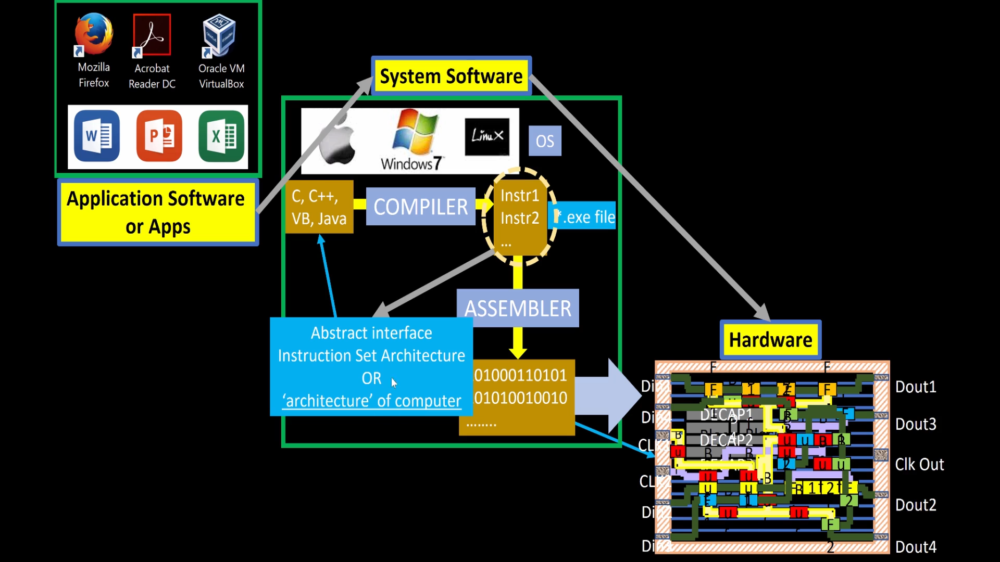

Getting a C program to run on a physical chip involves several translation steps. The C source is first turned into RISC-V assembly, and that assembly is then converted into machine-level binary — the 0s and 1s the chip actually executes. Connecting RISC-V assembly to the physical layout of the chip is a Hardware Description Language, which sits much closer to the actual hardware. Turning a RISC-V spec into silicon means implementing the architecture so registers can transfer data correctly — a process known as RTL-to-GDSII flow, which is what guarantees every application ultimately runs correctly on the hardware.

Getting an application onto hardware also depends on the software stack sitting underneath it: the operating system, the compiler, and the assembler. The OS manages things like I/O and memory allocation. The compiler converts high-level code (C, C++, etc.) into instructions shaped by the underlying hardware — on a RISC-V system, that means RISC-V instructions. The assembler then converts those instructions into binary machine code, which is what the hardware actually consumes. This chain of instructions is the bridge between a high-level language and the physical hardware, and that bridge has a name: the Instruction Set Architecture (ISA). At the hardware level, everything ultimately reduces to 0s and 1s — the shared language between software and silicon.

### Illustration of the RISC-V gnu toolchain

#### O1 mode 
Take this simple C program that sums the numbers from 1 to n:

```
#include<stdio.h>
int main()
{
    int i ,sum=0,n=9;
    for (i=1;i<=n;i++)
        sum+=i;
    printf("The sum of numbers from 1 to %d is %d\n",n,sum);
    return 0;
}
```
Compile it into RISC-V assembly with the riscv-gnu-toolchain:

```
cd /home/kanish/RISCV-ISA/riscv_isa_labs/day_1/lab1
riscv64-unknown-elf-gcc -O1 -mabi=lp64 -march=rv64i -o sum1ton_O1.o sum1ton.c
riscv64-unknown-elf-objdump -d sum1ton_O1.o | less
spike pk sum1ton_O1.o 
```

**Output of the disassembled file**


Search for `/main` or `/printf` inside the disassembly view to jump straight to those subroutine addresses.
Press `:q` to exit.

___
***Command breakdown:***

**riscv64-unknown-elf-gcc** — the RISC-V-targeted gcc compiler.

**-O1/-Ofast** — sets the optimization level used during compilation. `-O1` is a light optimization pass; higher levels like `-O2`/`-O3` can squeeze out more speed at the cost of longer build times. `-Ofast` goes further still, enabling aggressive optimizations beyond what `-O3` applies.

**-mabi=lp64** — specifies the calling convention for integers and floats. The ABI string encodes integer size plus which registers handle floating point. "lp64" means both `long` integers and pointers are 64 bits wide.

**-march=rv64i** — targets a specific RISC-V ISA variant. ISA strings are always lowercase, e.g. `rv64i`, `rv32g`, `rv32e`, `rv32imaf`. Here, `rv64i` means a 64-bit RISC-V core with just the base integer ("i") instruction set.

**-o sum1ton_O1.o** — names the compiled output file, `sum1ton_O1.o` in this case.

**sum1ton.c** — the C source file being compiled.

**riscv64-unknown-elf-objdump** — a utility for inspecting object files, executables, and libraries.

**-d** — puts objdump into disassembly mode, printing the machine instructions decoded from the binary.

**sum1ton_O1.o** — the object file being disassembled, produced from `sum1ton.c` by the compile step above.

**spike** — a RISC-V ISA simulator that models processor behavior, letting you run RISC-V binaries on a non-RISC-V host as if they were on real hardware.

**pk** — the "proxy kernel," a lightweight runtime that gives simulated programs the minimal OS-like services (memory management, system calls, etc.) they need to run under Spike.

___

To step through execution line by line:
```
spike -d pk sum1ton_O1.o 
until pc 0 10184
reg 0 sp
#Press enter for line by line execution
reg 0 a2
```

___
***Command breakdown:***

**-d (spike flag)** — runs Spike in debug mode, letting you inspect and step through execution closely — great for tracing behavior and hunting bugs.

**until pc 0 10184** — runs the program until the program counter hits address `10184`.

**reg 0 sp** — prints the current value of a register, here the stack pointer (`sp`).
___

**Spike debug-mode output:**


#### Ofast mode
Using the same [C program](#o1-mode) as above:

Compile it this time with `-Ofast` via the riscv-gnu-toolchain:

```
cd /home/kanish/RISCV-ISA/riscv_isa_labs/day_1/lab1
riscv64-unknown-elf-gcc -Ofast -mabi=lp64 -march=rv64i -o sum1ton_Ofast.o sum1ton.c
riscv64-unknown-elf-objdump -d sum1ton_Ofast.o | less
spike pk sum1ton_Ofast.o 
```

**Output of the disassembled file**


**Observation** — the same C code, compiled with `-Ofast`, results in noticeably fewer instructions than the `-O1` build.

### Data Representation
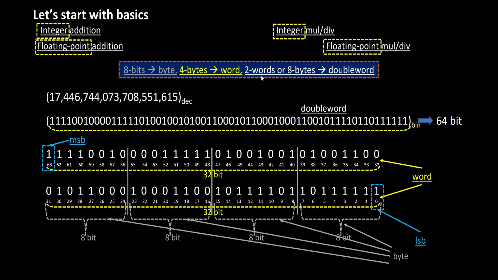

A handful of terms come up constantly when discussing how RISC-V (and computer architecture generally) represents and stores data:

1. **Byte** — the basic unit of storage: 8 bits, enough to represent a single character or small value.

2. **Word** — the "natural" data size a processor works with; it varies by architecture. On RV32 a word is 4 bytes (32 bits); on RV64 it's 8 bytes (64 bits).

3. **Double Word** — twice the width of a word. On RV32 that's 8 bytes (64 bits); on RV64 it's 16 bytes (128 bits).

4. **Least Significant Bit (LSB)** — the lowest-order bit in a binary value.

5. **Most Significant Bit (MSB)** — the highest-order bit, carrying the most weight in the value (the largest power of two it represents).

6. **Endianness** — how a multi-byte value is laid out in memory. Big-endian systems store the most significant byte at the lowest address; little-endian systems store the least significant byte there instead. RISC-V supports both.

7. **Byte addressing** — a memory scheme where every individual byte has its own unique address, so any single byte can be accessed directly. RISC-V memory, like most modern architectures, is byte-addressable.

These concepts underpin memory allocation, data layout, and general programming on RISC-V.


### Representation of Signed and Unsigned Numbers
#### Unsigned Numbers
Unsigned numbers carry no sign — only magnitude — so every unsigned binary value is non-negative. With no sign bit reserved, all N bits go toward representing the magnitude. Zero counts as unsigned too. Each value has exactly one binary encoding, making the representation unambiguous. An N-bit unsigned value ranges from **0 to ((2^n)-1)**.

#### Signed Numbers
Signed values are typically represented using 2's complement: invert every bit and add 1 to the least significant bit to get the 2's complement of a number. Positive numbers stay in plain binary form; negative numbers use their 2's complement form, with one bit reserved to signal the sign. A sign bit of 0 means the value is positive and can be read directly as binary; a sign bit of 1 means it's negative, and you take the 2's complement to interpret it. Zero has a single, always-positive representation. An N-bit 2's-complement value ranges from **(-2^(n-1)) to ((2^(n-1))-1)**.

### Illustration of Signed and Unsigned Numbers in RISC-V
#### Unsigned Numbers

Here's a C program that shows the largest unsigned value an RV64I system can hold:

```
#include<stdio.h>
#include<math.h>

int main()
{
    unsigned long long int max = (unsigned long long int)(pow(2,64)-1); //Line 1
    // unsigned long long int max = (unsigned long long int)(pow(2,127)-1);// Line 2
    // unsigned long long int max = (unsigned long long int)(pow(2,64)*-1);// Line 3
    // unsigned long long int max = (unsigned long long int)(pow(-2,64)-1);// Line 4
    // unsigned long long int max = (unsigned long long int)(pow(-2,63)-1);// Line 5
    // unsigned long long int max = (unsigned long long int)(pow(2,10)-1);// Line 6
    printf("Highest number represented by unsigned long long  int is %llu \n",max);
    return 0;
}
```
___
***Note***</br>

**%llu** — format specifier for a 64-bit unsigned integer.

**%lld** — format specifier for a 64-bit signed integer.

Try uncommenting each line in turn to see the result change.
___

- Line 1 runs as expected, producing (2^64)-1.</br>
- Line 2 still produces (2^64)-1 rather than (2^127)-1, since that's the ceiling a 64-bit unsigned register can hold.</br>
- Line 3 produces 0 instead of -(2^64), because an unsigned 64-bit register can't go below 0.</br>
- Line 4 produces 0 instead of (2^64)-1.</br>
- Line 5 produces 0 instead of -(2^64), same floor-at-zero reasoning as Line 3.</br>
- Line 6 correctly produces 1024, since that value comfortably fits under (2^64)-1.

To compile and run this on the RISC-V gnu toolchain:

```
cd /home/kanish/RISCV-ISA/riscv_isa_labs/day_1/lab2
riscv64-unknown-elf-gcc -Ofast -mabi=lp64 -march=rv64i -o unsignedHighest.o unsignedHighest.c 
spike  pk unsignedHighest.o 
```

**Output of the execution**


#### Signed Numbers

Here's a C program showing the maximum and minimum signed values RV64I can represent:


```
#include<stdio.h>
#include<math.h>

int main()
{
    long long int max = (long long int)(pow(2,63)-1);
    long long int min = (long long int)(pow(-2,63));
    printf("Highest number represented by long long  int is %lld \n",max);
    printf("Smallest number represented by long long  int is %lld \n",min);
    return 0;
}
```
Compile and run on the RISC-V gnu toolchain:

```
cd /home/kanish/RISCV-ISA/riscv_isa_labs/day_1/lab2
riscv64-unknown-elf-gcc -Ofast -mabi=lp64 -march=rv64i -o signedHighest.o unsignedHighest.c 
spike  pk signedHighest.o 
```


## Day - 2 : Introduction to ABI and Basic Verification Flow

### RV64I Base Integer Instruction Set
RV64I is the 64-bit base integer instruction set, extending RV32I. The two share the bulk of their instructions, differing mainly in register width, with RV64I adding a handful of extra instructions of its own. Combined, the base integer set totals 47 instructions — 35 inherited from RV32I plus 12 unique to RV64I. Their formats are shown below:

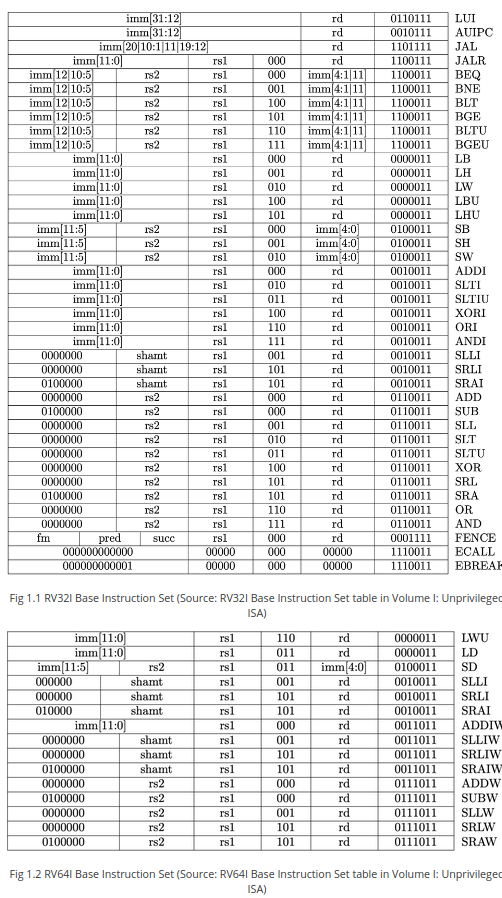

There are 31 general-purpose registers, x1 through x31, used for holding integer values, while x0 is hardwired to the constant zero. There's no dedicated hardware register for a subroutine's return address, but by convention x1 is used to hold it across calls. On RV32 the x registers are 32 bits wide; on RV64 they're 64 bits wide. XLEN is the term used for whichever width is currently in effect.

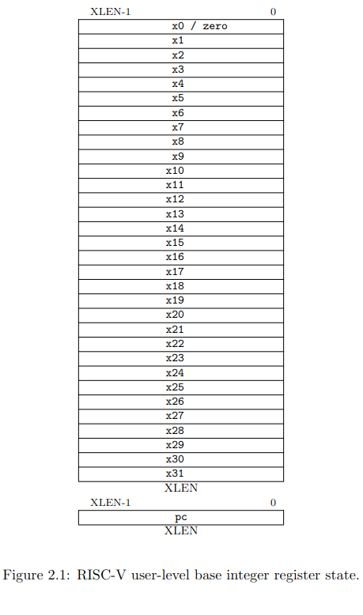

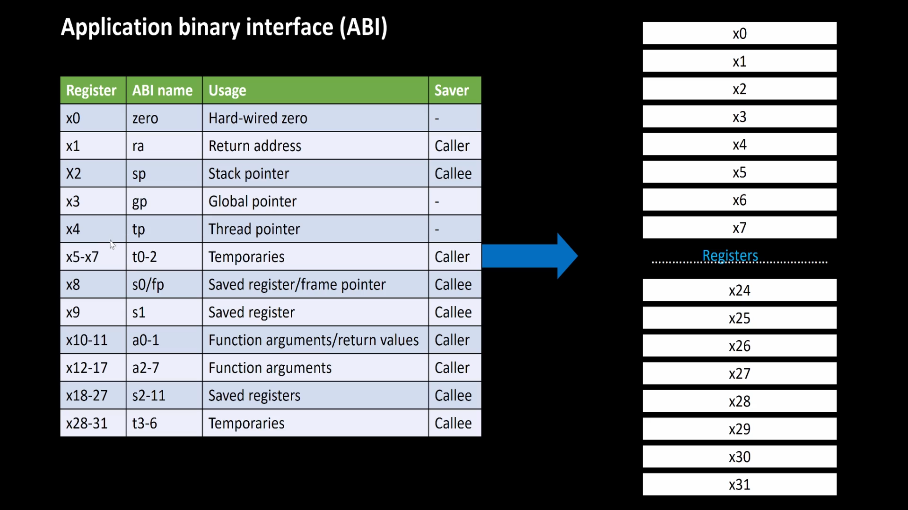

RISC-V instructions fall into several formats, each identified by a single letter based on its opcode and operand layout:

- **R-Type (Register Type)** — operates on two source registers, writing the result to a destination register. Covers arithmetic, logic, and bitwise operations. Format: `opcode rd, rs1, rs2`.

- **I-Type (Immediate Type)** — combines a source register with an immediate (constant) operand for arithmetic, logic, or memory operations. Format: `opcode rd, rs1, imm`.

- **S-Type (Store Type)** — writes data to memory, combining a source register, a base register, and an immediate offset to compute the target address. Format: `opcode rs2, imm(rs1)`.

- **B-Type (Branch Type)** — used for conditional branching, comparing two source registers and using an immediate offset to compute the branch target. Supports comparisons like equal, not-equal, and greater/less-than. Format: `opcode rs1, rs2, imm`.

- **U-Type (Upper Immediate Type)** — loads immediate values into a register, including for unconditional jumps. Works with a single register plus an immediate that fills in the upper bits of the result. Format: `opcode rd, imm`.

- **J-Type (Jump Type)** — handles unconditional jumps using an immediate offset to compute the jump target; commonly used for function calls and other control-flow changes. Format: `opcode rd, imm`.

Instruction formats for each type, shown below:

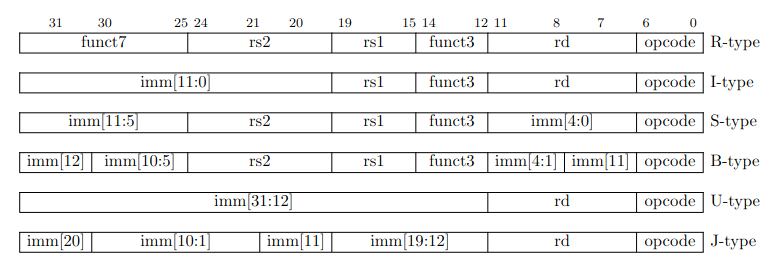

For instruction details, see the [spec](https://riscv.org/wp-content/uploads/2017/05/riscv-spec-v2.2.pdf).

### Application Binary Interface (ABI)
The ABI defines how software components — programs, libraries — interact at the binary level: how data is passed around, how function calls work, and how data structures are laid out in memory. It's what keeps different parts of a software ecosystem compatible even across languages and compilers. Applications reach the RISC-V hardware registers directly through system calls, and the ABI (sometimes called the system call interface) is what governs that access, exposing hardware resources through registers. A system call is simply a request the program makes to the OS for something it can't do on its own — reading a file, say, where the program asks the OS to fetch the data and hand it back. System calls give programs a controlled path to more powerful OS features while staying within ABI rules. The ISA itself splits into two layers: a system-level portion and a user-level portion, with the user directly reaching the latter via system calls.


### Illustration of ABI
Here's a C program that sums 1 through 9:
```
#include<stdio.h>

extern int load(int x, int y);

int main()
{
    int result = 0;
    int count = 9;
    result = load(0x0,count+1);
    printf("Sum of numbers from 1 to %d is %d\n",count,result);
    
}
```

And the corresponding assembly (ASM):
```
.section .text 
.global load
.type load, @function

load:
    add a4, a0, zero
    add a2, a0, a1
    add a3, a0, zero
loop : add a4, a3, a4
       addi a3, a3, 1
       blt a3, a2, loop
       add a0, a4, zero
       ret
```
The flow chart of the routine implemented by this ASM code:
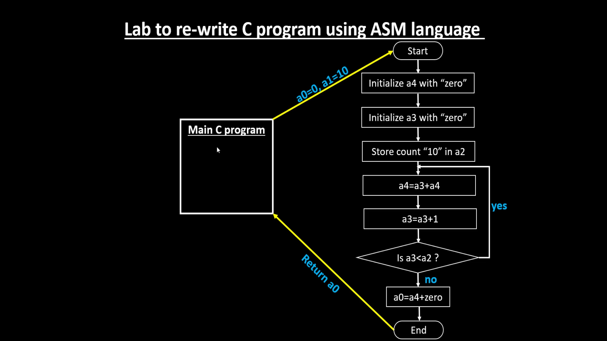

This example demonstrates the ABI in action: the C code passes values into the assembly routine through the `load` function, the assembly computes the result, and the value flows back to C, where it's printed.

**Steps for this lab**
```
cd ~/RISCV-ISA/riscv_isa_labs/day_2/lab1/
riscv64-unknown-elf-gcc -Ofast -mabi=lp64 -march=rv64i -o custom1_to9.o custom1_to_9.c load.S
riscv64-unknown-elf-objdump -d custom1_to9.o | less
spike pk custom1_to9.o
```

**Outputs of the Lab**


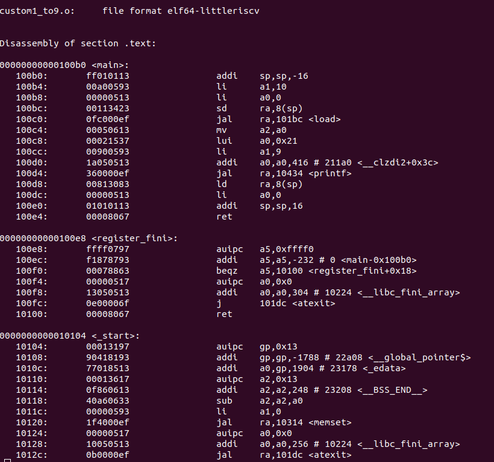

### RISC-V Basic Verification flow using iverilog demo
Verifying a RISC-V CPU means converting the C code into a HEX file, feeding it into the CPU model, and checking the resulting output. The block diagram illustrates the flow:

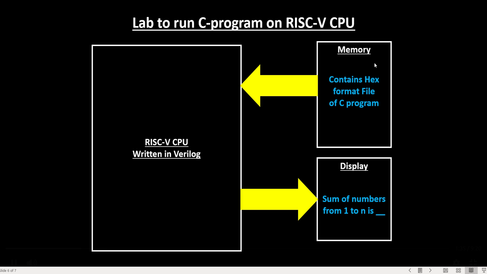

To run the demo, go to the lab directory:
```
cd ~/riscv_workshop_collaterals/labs/
chmod 777 rv32im.sh
./rv32im.sh  # Contains necessary commands to convert C to hex
```

**Output, Script(rv32im.sh) and firmare.hex**


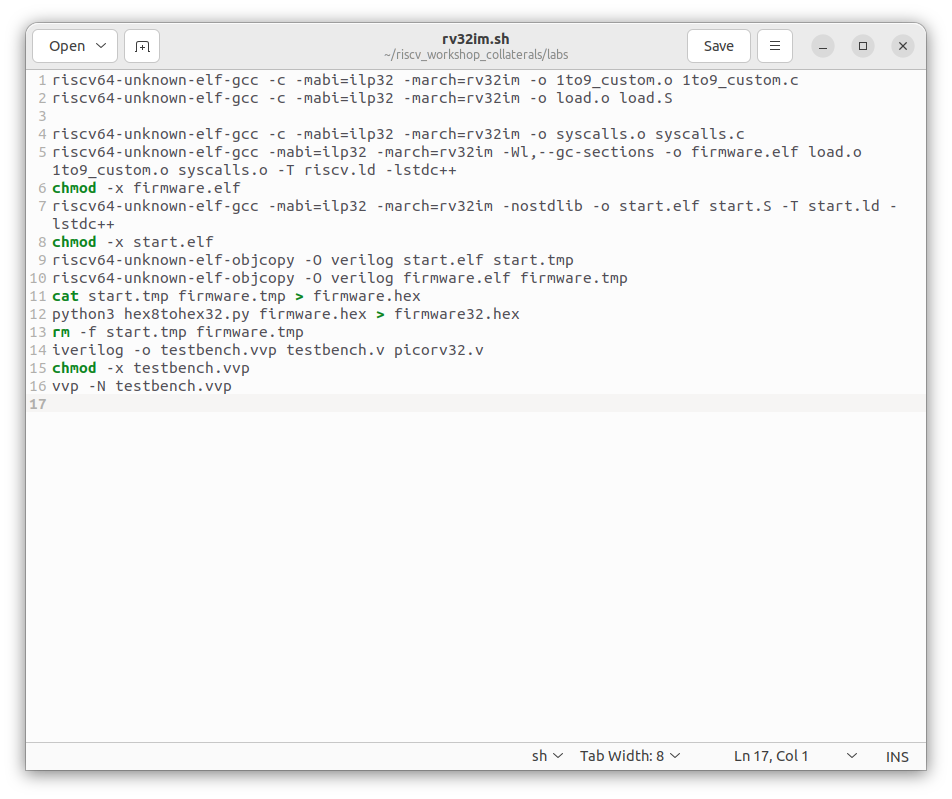

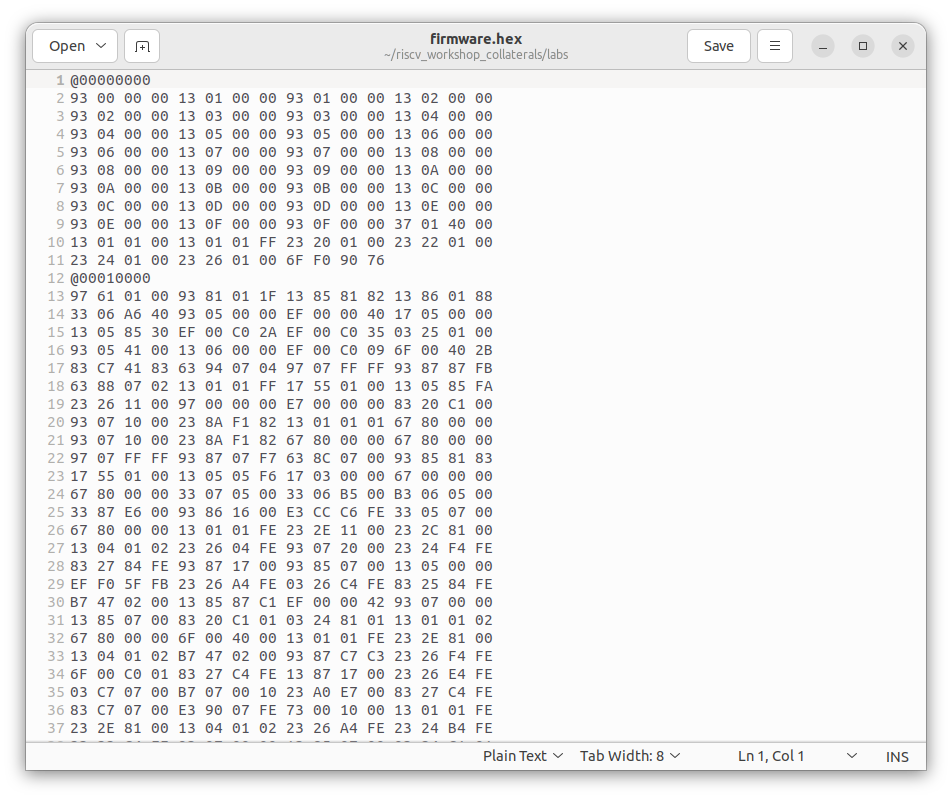


## Day - 3 : Digital Logic with TL-Verilog and Makerchip
### Logic Gates
Logic gates are the fundamental building blocks of digital circuits, performing logical operations on inputs to produce outputs according to fixed rules. They underpin every complex digital system — processors, memory, controllers, and beyond. Since gates operate on binary signals (0 and 1, mapped to low/high voltage), each gate takes one or more inputs and applies a logical function to produce its output.

Common gate types are shown below:
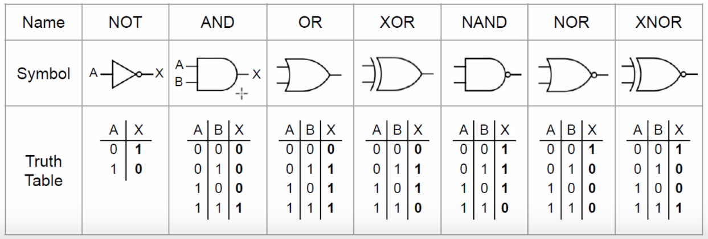

Gates combine to form more complex circuits. NAND and NOR are known as "universal" gates because any other gate can be built purely from either one. Their Verilog representation:

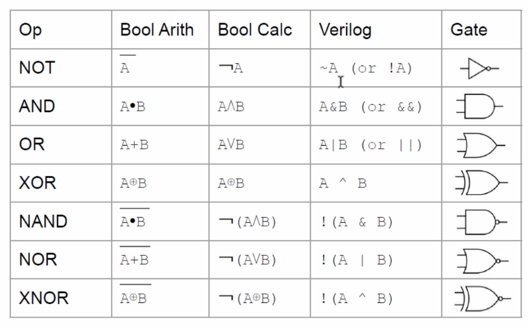


### Multiplexer Using Ternary Operator
Here's a simple multiplexer written in Verilog:
```
assign f = s ? x1 : x0;
```
This ternary expression builds a 2:1 multiplexer — output `f` tracks `x1` when `s` is 1, and `x0` otherwise. The corresponding hardware and gate-level view:

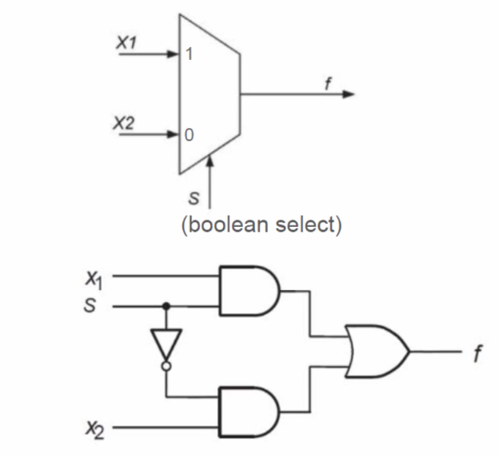

The same conditional-operator approach scales to wider multiplexers. Here's a 4:1 example:

```
assign f = sel[0] ? a : (sel[1] ? b : (sel[2] ? c : d));
```
This gives input `a` top priority and `d` the least, and rather than one single 4:1 mux it synthesizes as a chain of 2:1 muxes. Here `sel` is one-hot — only a single bit is high at any time. The resulting hardware:

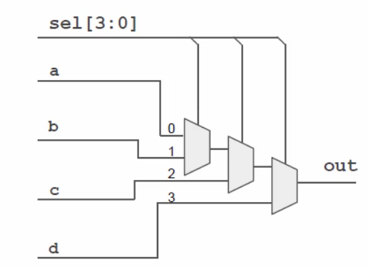

### Transaction Level(TL) - Verilog
TL-Verilog is Redwood EDA's Verilog implementation of TL-X, a language extension that layers transaction-level modeling onto any HDL. It's designed for concise, efficient design capture while remaining Verilog-compatible, stripping away legacy syntax overhead in favor of something simpler. It's built specifically for the design process rather than just describing a static design after the fact. In transaction-level thinking, a "transaction" is an entity that flows through the microarchitecture, being operated on and steered by structures like pipelines, arbiters, and queues. TL-Verilog aims to make writing and editing Verilog faster and less error-prone, and it's what Makerchip is built around.

### Makerchip IDE
Makerchip is an integrated development environment purpose-built for digital design and HDL work. It gives engineers, students, and hobbyists a single environment for designing, simulating, and testing digital circuits, with a friendly interface that supports TL-Verilog, SystemVerilog, Verilog, and VHDL. Inside Makerchip, you assemble digital systems from both pre-built and custom components — logic gates, flip-flops, multiplexers, and more — on a visual canvas where you wire everything together. One standout feature is real-time simulation: you can run and observe your design's behavior immediately, catching problems early rather than after committing to hardware. Overall, it's a strong tool for exploring and learning digital logic design, from first-timers to seasoned designers.

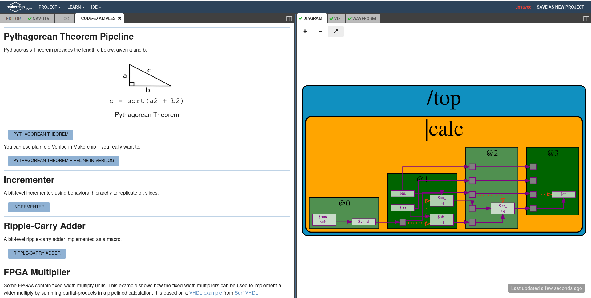

### Basic Combinational Circuits in Makerchip

#### Pythagorean Example Demo

___
***Note**</br>
Unlike plain Verilog, `$in` and `$out` ports don't need explicit declarations.
Makerchip also expects three-space indentation to be preserved consistently.
___

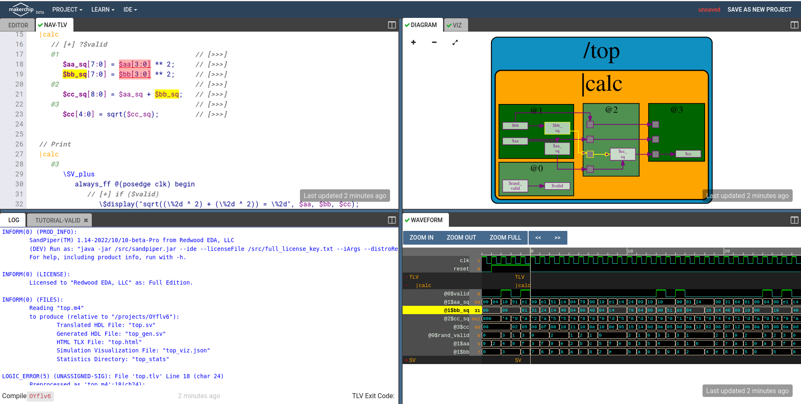

#### Inverter

TL-Verilog code:
```
   $out = $in;
```

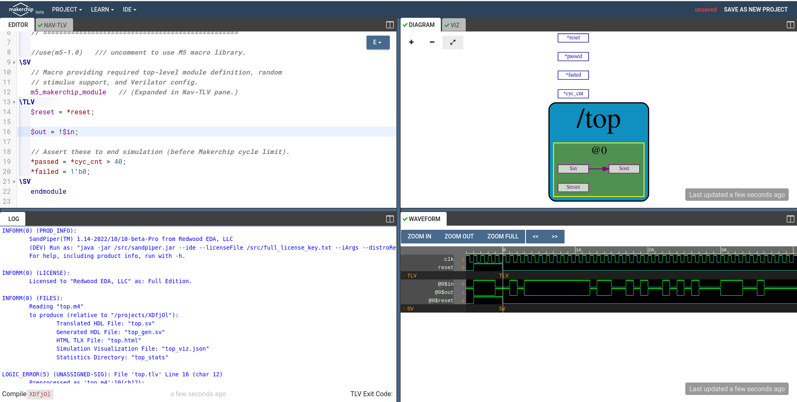

#### AND gate

TL-Verilog code:
```
   $out = $in1 && $in2;
```


#### OR gate

TL-Verilog code:
```
   $out = $in1 || $in2;
```


#### XOR gate

TL-Verilog code:
```
   $out = $in1 ^ $in2;
```


#### Vector Addition

TL-Verilog code:
```
   $out[5:0] = $in1[4:0] + $in2[4:0];
```
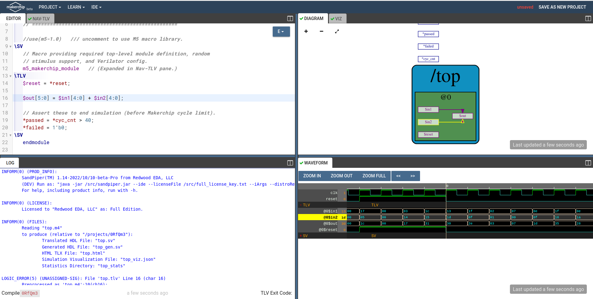

#### 2:1 Multiplexer

TL-Verilog code:
```
   $out = $sel ? $in1 : $in0;
```


#### 2:1 Vector Multiplexer

TL-Verilog code:
```
   $out[7:0] = $sel ? $in1[7:0] : $in0[7:0];
```


#### Calculator

TL-Verilog code:
```
   $reset = *reset;
   $op[1:0] = $random[1:0];
   
   $val1[31:0] = $rand1[3:0];
   $val2[31:0] = $rand2[3:0];
   $sum[31:0] = $val1+$val2;
   $diff[31:0] = $val1-$val2;
   $prod[31:0] = $val1*$val2;
   $div[31:0] = $val1/$val2;
   
   $out[31:0] = $op[1] ? ($op[0] ? $div : $prod):($op[0] ? $diff : $sum);
```
Opcode function table:

| Opcode | Function|
| :------: | :-------: |
| 2'b00 | Addition |
| 2'b01 | Subtraction |
| 2'b10 | Multiplication |
| 2'b11 | Division |


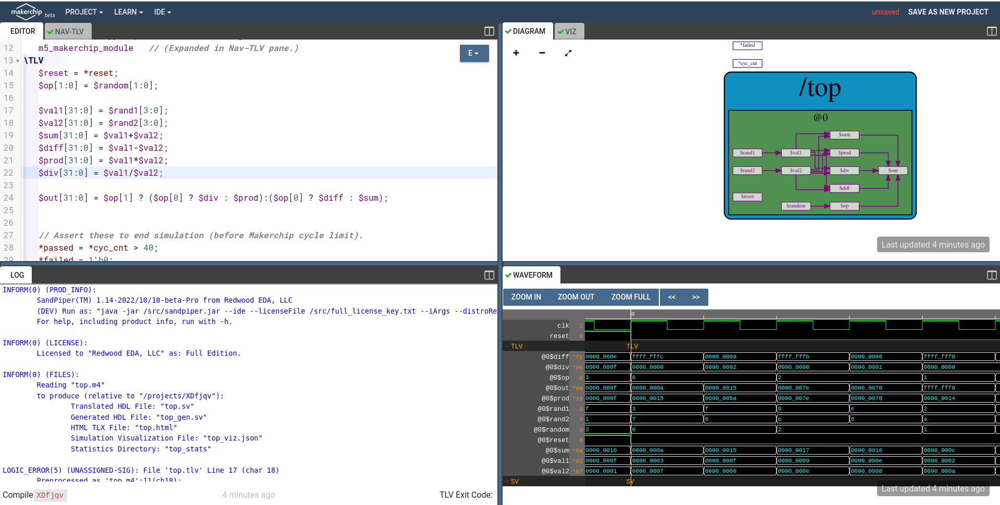

### Sequential Circuits
A sequential circuit uses memory to make its outputs depend not just on the current inputs, but also on prior state. Unlike combinational circuits, which react purely to present inputs, sequential circuits use feedback loops and memory elements (flip-flops, registers) to retain and act on internal state over time.


### Basic Sequential Circuits in Makerchip

#### Fibonacci Series

TL-Verilog for a Fibonacci sequence generator:
```
   $reset = *reset;
   $num[31:0] = $reset ? 1 : (>>1$num + >>2$num);
```

___
1 - the previous cycle's value of `num`
2 - the value of `num` two clock cycles back
___

Block diagram of the Fibonacci generator:
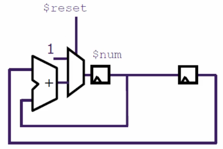

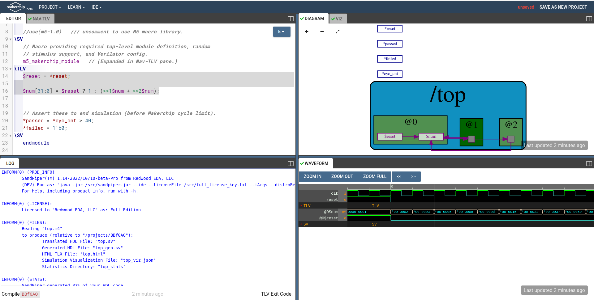

#### Free running counter

TL-Verilog for a free-running counter:
```
   $reset = *reset;
   $cnt[31:0] = $reset ? 0 : (>>1$cnt + 1);
```
Block diagram of the free-running counter:
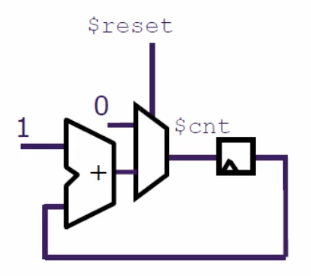

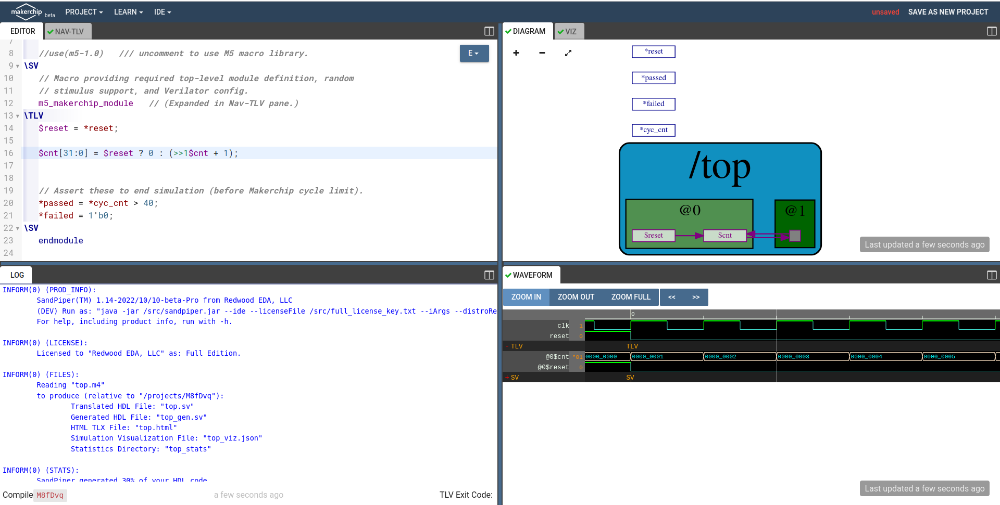


#### Counter-Output with Calculator  Integration
TL-Verilog code:
```
   reset = *reset;
   
   $cnt1[31:0] = $reset ? 0 : (>>1$cnt1 + 3);
   $cnt2[31:0] = $reset ? 0 : (>>1$cnt2 + 4);
   $cnt3[1:0] = $reset ? 0 : (>>1$cnt3 + 1);
   
   $op[1:0] = $cnt3;
   
   $val1[31:0] = $cnt1;
   $val2[31:0] = $cnt2;
   $sum[31:0] = $val1+$val2;
   $diff[31:0] = $val1-$val2;
   $prod[31:0] = $val1*$val2;
   $div[31:0] = $val1/$val2;
   
   $out[31:0] = $op[1] ? ($op[0] ? $div : $prod):($op[0] ? $diff : $sum);
```

[calc_int](./riscv_isa_labs/day_3/lab2/images/calc_int.png)

#### Sequential Calculator
TL-Verilog for a sequential calculator:
```
   $reset = *reset;
   
   $cnt2[2:0] = $reset ? 0 : (>>1$cnt2 + 1);
   $cnt3[1:0] = $reset ? 0 : (>>1$cnt3 + 1);
   
   $op[1:0] = $cnt3;
   
   $val1[31:0] = >>1$out;
   $val2[31:0] = $cnt2;
   $sum[31:0] = $val1+$val2;
   $diff[31:0] = $val1-$val2;
   $prod[31:0] = $val1*$val2;
   $div[31:0] = $val1/$val2;
   
   $out[31:0] = $reset ? 32'h0 : ($op[1] ? ($op[0] ? $div : $prod):($op[0] ? $diff : $sum));
```

Here the previous result feeds back in as an operand for the next operation, mimicking a real calculator. A reset zeroes the accumulated result.

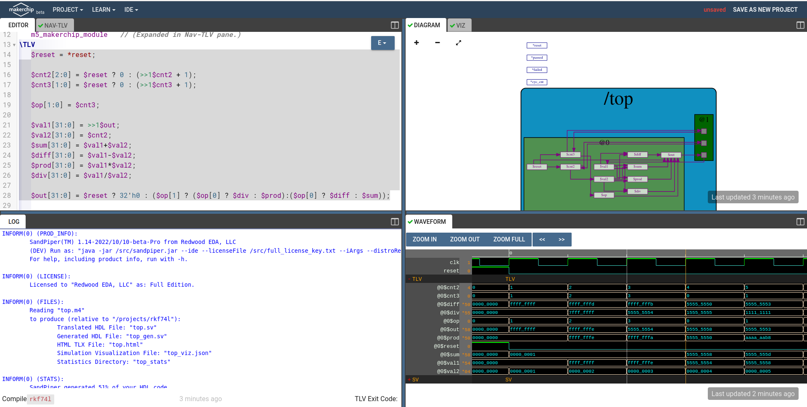


### Pipelining
Pipelining boosts throughput by splitting a complex task into smaller sequential stages that execute concurrently — different stages working on different instructions at the same time. Rather than finishing one instruction fully before starting the next, a pipelined design overlaps execution across stages, cutting the overall time to process a sequence of tasks.

### Identifiers and Types in TL-Verilog
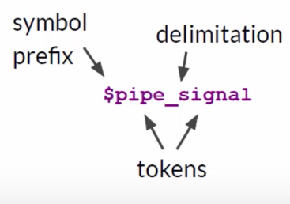

TL-Verilog enforces strict naming rules: identifiers must begin with two alphabetic characters. Three casing styles are used to distinguish signal roles:
1. `$lower_case` — pipe signal
2. `$CamelCase` — state signal
3. `$Upper_CASE` — keyword signal

Numbers are allowed at the end of a token (e.g. `$base64_value`) but not embedded mid-token (`$base_64` is invalid).
### Basic Pipelined Circuits

#### Pipelined Pythagorean
TL-Verilog code:
```
\m5_TLV_version 1d: tl-x.org
\m5
   
   // =================================================
   // Welcome!  New to Makerchip? Try the "Learn" menu.
   // =================================================
   
   //use(m5-1.0)   /// uncomment to use M5 macro library.
\SV
   // Macro providing required top-level module definition, random
   // stimulus support, and Verilator config.
   m5_makerchip_module   // (Expanded in Nav-TLV pane.)
   
   `include "sqrt32.v"
\TLV
   $reset = *reset;
   $aa = $rand1[3:0];
   $bb = $rand2[3:0];
   |calc
      @1
         $aa_sq[31:0] = $aa * $aa;
      @2
         $bb_sq[31:0] = $bb * $bb;
      @3
         $cc_sq[31:0] = $aa_sq + $bb_sq;
      @4
         $out[31:0] = sqrt($cc_sq);
   
   // Assert these to end simulation (before Makerchip cycle limit).
   *passed = *cyc_cnt > 40;
   *failed = 1'b0;
\SV
   endmodule
```
 ___
 **@** — marks the pipeline stage number.
 
 **|** — marks the code block that's pipelined.
 
 The square-root logic lives in `sqrt32.v`, included by default in Makerchip.
 ___

 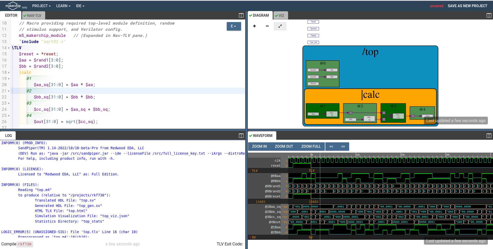

#### Error Detection Demo
TL-Verilog code:
```
|comp
      @1
         $err1 = $bad_input || $illegeal_op;
      @3
         $err2 = $err1 || $over_flow;
      @6
         $err3 = $err2 || $div_by_zer0;

```

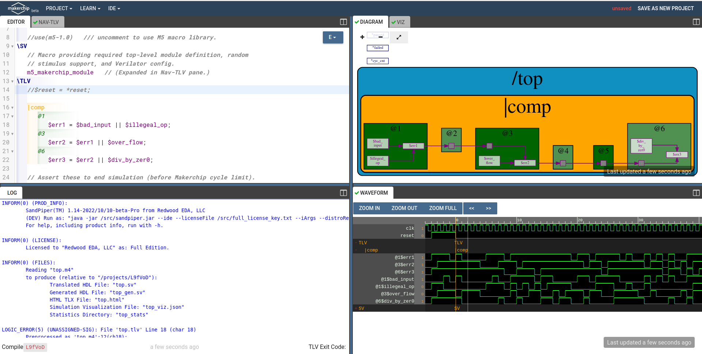

#### Counter and Calculator in Pipeline
Block diagram of the pipelined counter-plus-calculator:
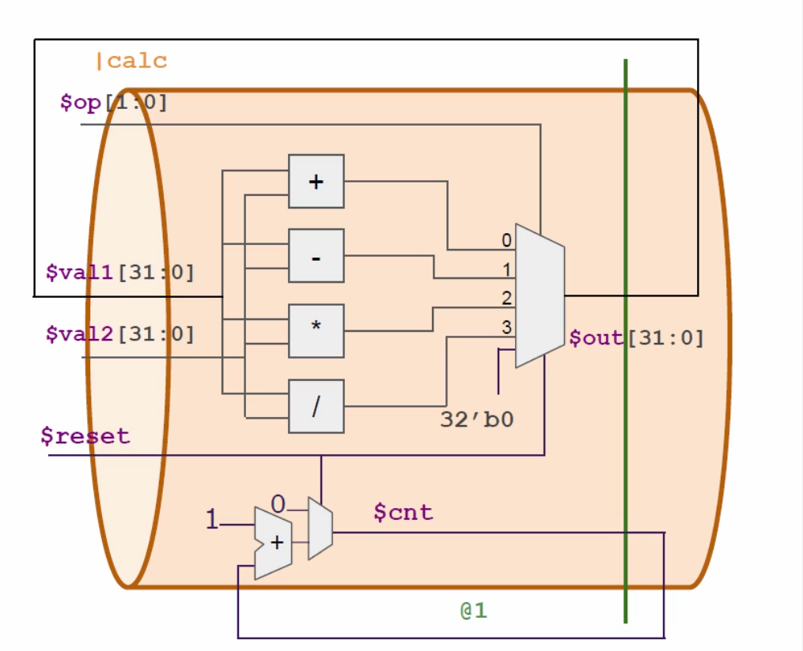

TL-Verilog code:
```
   $reset = *reset;
   $op[1:0] = $random[1:0];
   $val2[31:0] = $rand2[3:0];
   
   |calc
      @1
         $val1[31:0] = >>1$out;
         $sum[31:0] = $val1+$val2;
         $diff[31:0] = $val1-$val2;
         $prod[31:0] = $val1*$val2;
         $div[31:0] = $val1/$val2;
         $out[31:0] = $reset ? 32'h0 : ($op[1] ? ($op[0] ? $div : $prod):($op[0] ? $diff : $sum));
         
         $cnt[31:0] = $reset ? 0 : (>>1$cnt + 1); 

```

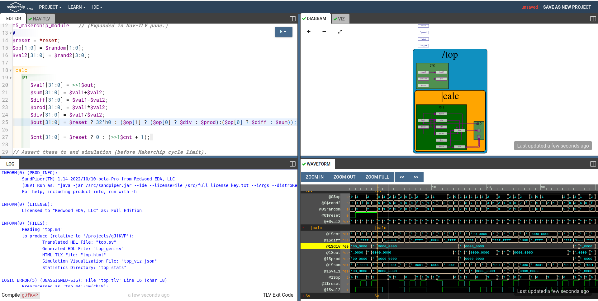

#### 2 Cycle Calculator
Block diagram of the two-cycle calculator:
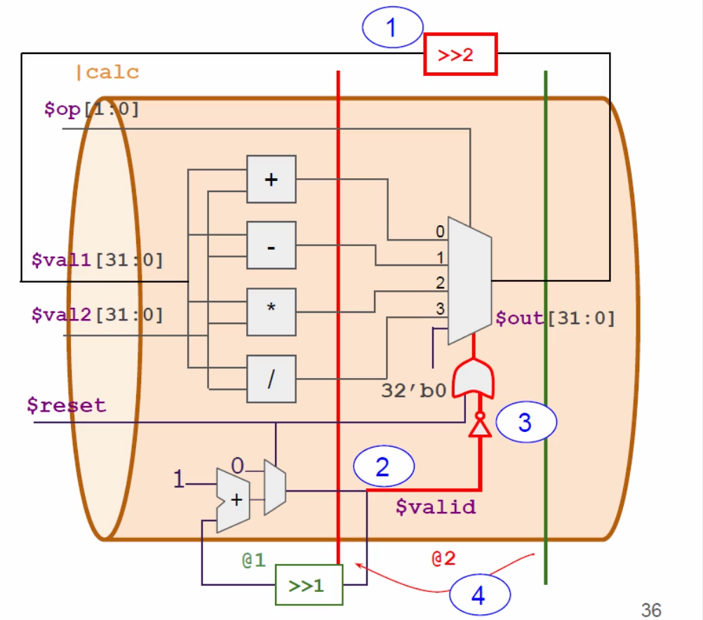

TL-Verilog code:
```
   $reset = *reset;
   $op[1:0] = $random[1:0];
   $val2[31:0] = $rand2[3:0];
   
   |calc
      @1
         $val1[31:0] = >>2$out;
         $sum[31:0] = $val1+$val2;
         $diff[31:0] = $val1-$val2;
         $prod[31:0] = $val1*$val2;
         $div[31:0] = $val1/$val2;
         $valid = $reset ? 0 : (>>1$valid + 1);
      @2
         $out[31:0] = ($reset | ~($valid))  ? 32'h0 : ($op[1] ? ($op[0] ? $div : $prod):($op[0] ? $diff : $sum));
```

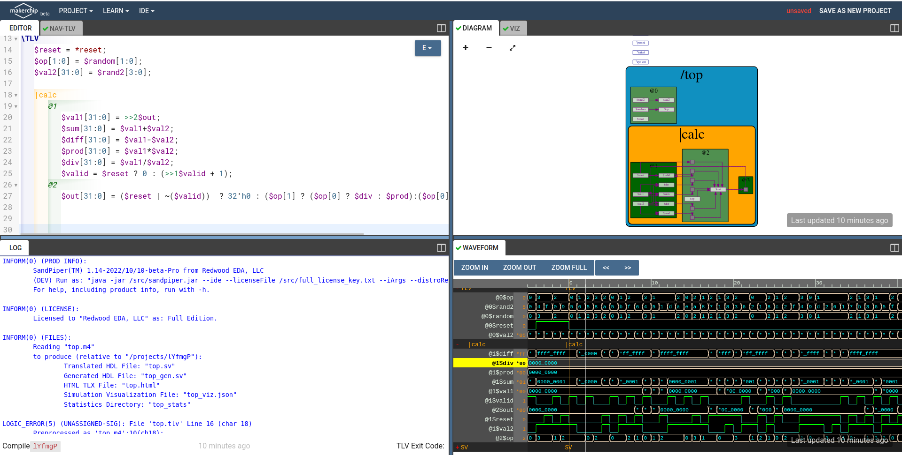

### Validity
In TL-Verilog, "validity" tracks the state and timing of transactions moving through a design. A transaction here means a higher-level action or event represented by a bundle of associated data and control signals, and validity captures whether that transaction should currently be treated as active ("valid") or not.
### Clock Gating
Clock gating is a power-saving technique that limits clock distribution to circuit blocks that don't need to be active. Since not every component needs to toggle on every clock edge — many spend significant time idle — clock gating selectively withholds the clock signal from those blocks to cut unnecessary switching activity and save power. Practically, this usually means inserting a gate (often an AND gate) into the clock path, controlled by a signal: when that control is high, the clock passes through to the block; when low, the clock is blocked and the block stays idle.

### Illustration of Validity

#### Distance Accumulator
Block diagram of the distance accumulator:

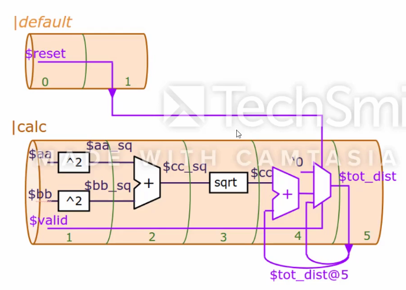

TL-Verilog code:
``` 
    calc
      @1
         $reset = *reset;
      ?$valid
         @1
            $aa_sq[31:0] = $aa[3:0] * $aa;
            $bb_sq[31:0] = $bb[3:0] * $bb;
         @2
            $cc_sq[31:0] = $aa_sq + $bb_sq;
         @3
            $out[31:0] = sqrt($cc_sq);
      @4
         $tot_dist[31:0] = $reset ? '0 : ($valid ? (>>1$tot_dist + $out) : $RETAIN);
```

When `valid` is asserted, the current result accumulates onto the running total; otherwise, the previous total simply holds.

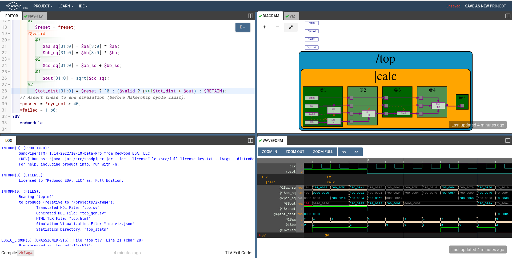

#### 2 Cycle Calculator with Validity
Block diagram of the two-cycle calculator with validity:

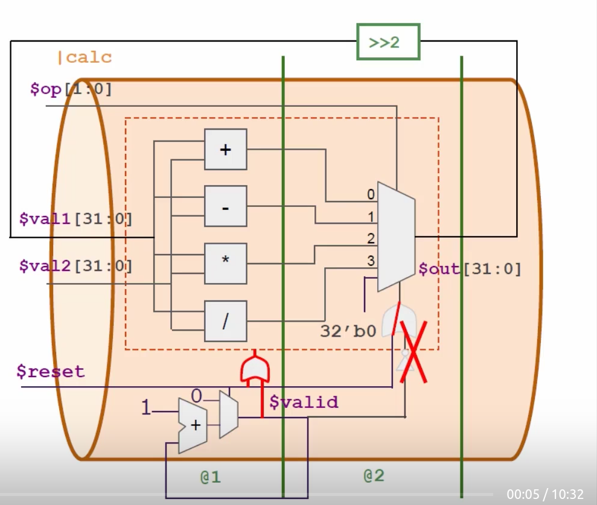

TL-Verilog code:
```
   $reset = *reset;
   |calc
      @1
         $valid = $reset ? 0 : >>1$valid+1;
         $valid_or_reset = $valid || $reset;
      ?$valid_or_reset
         @1
            $val1[31:0] = >>2$out;
            $sum[31:0] = $val1+$val2;
            $diff[31:0] = $val1-$val2;
            $prod[31:0] = $val1*$val2;
            $div[31:0] = $val1/$val2;
            $valid = $reset ? 0 : (>>1$valid + 1);
         @2
            $out[31:0] = $reset  ? 32'h0 : ($op[1] ? ($op[0] ? $div : $prod):($op[0] ? $diff : $sum));
```

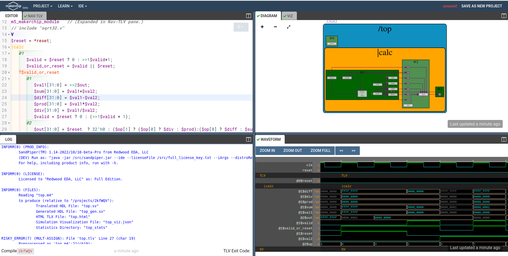

#### Calculator with Single Value Memory
Block diagram of the calculator with single-value memory:

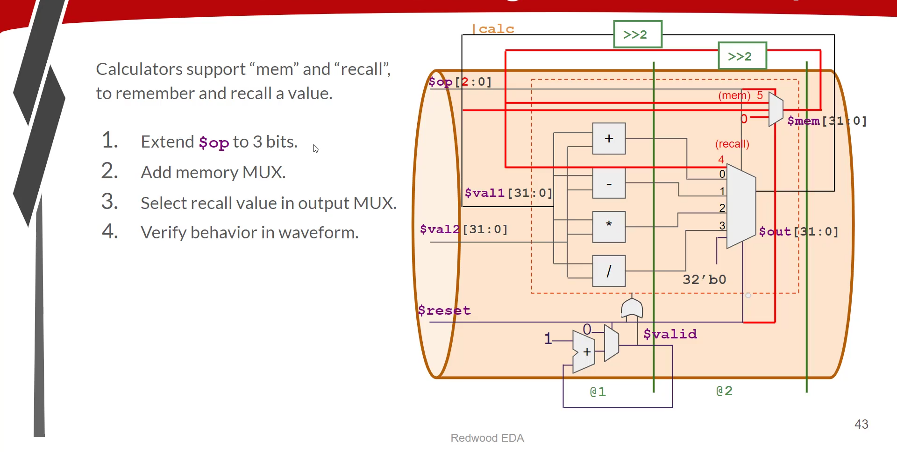

TL-Verilog code:
```
   |calc
      @0
         $reset = *reset;
         
      @1
         $val1 [31:0] = >>2$out;
         $val2 [31:0] = $rand2[3:0];
         
         $valid = $reset ? 1'b0 : >>1$valid + 1'b1 ;
         $valid_or_reset = $valid || $reset;
         
      ?$vaild_or_reset
         @1   
            $sum [31:0] = $val1 + $val2;
            $diff[31:0] = $val1 - $val2;
            $prod[31:0] = $val1 * $val2;
            $div[31:0] = $val1 / $val2;
            
         @2   
            $mem[31:0] = $reset ? 32'b0 :
                         ($op[2:0] == 3'b101) ? $val1 : >>2$mem ;
            
            $out [31:0] = $reset ? 32'b0 :
                          ($op[2:0] == 3'b000) ? $sum :
                          ($op[2:0] == 3'b001) ? $diff :
                          ($op[2:0] == 3'b010) ? $prod :
                          ($op[2:0] == 3'b011) ? $quot :
                          ($op[2:0] == 3'b100) ? >>2$mem : >>2$out ;

```
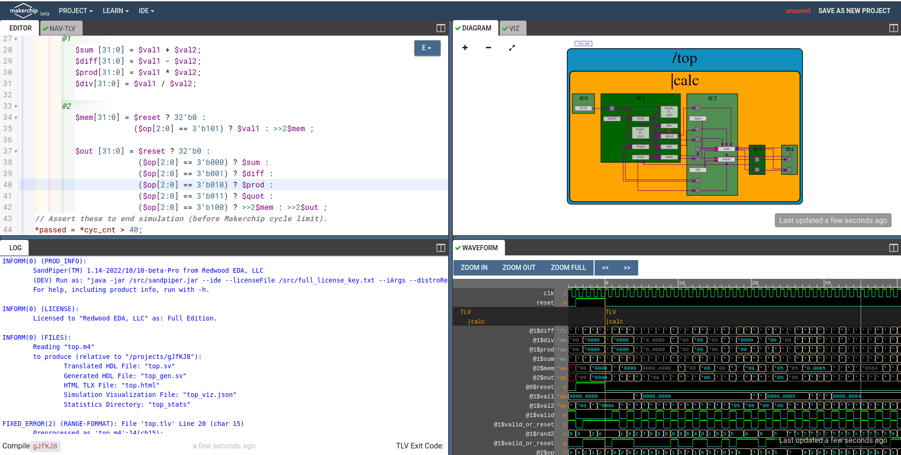


## Day - 4 : Building a RISC-V CPU core Micro-architecture
Block diagram of the basic RISC-V CPU:

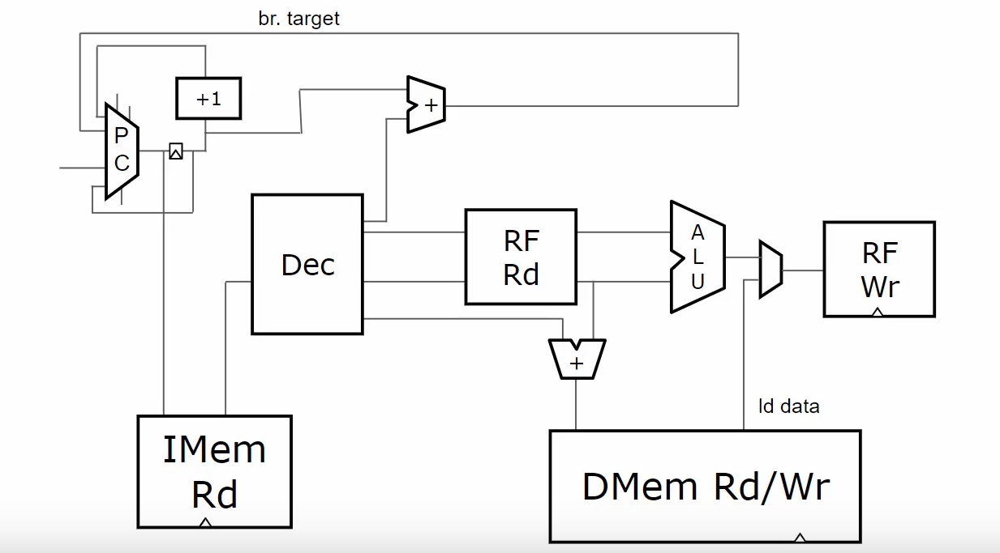

**1. Program Counter (PC)** — a dedicated register that tracks the memory address of the next instruction to execute. It increments as instructions are fetched and feeds instruction memory the address to fetch next.

**2. Instruction Decoder** — interprets fetched machine instructions, decoding their binary encoding into control signals that drive the rest of the CPU's execution of that instruction.

**3. Instruction Memory** — holds the program's machine instructions, typically read-only. The PC supplies the address used to fetch from it.

**4. Data Memory** — stores the data a program manipulates during execution — variables, arrays, and so on — and unlike instruction memory, supports both reads and writes.

**5. ALU (Arithmetic Logic Unit)** — the circuit that performs arithmetic and logic operations: addition, subtraction, multiplication, division, bitwise ops (AND/OR/XOR), and comparisons, producing results used throughout the pipeline.

**6. Read Register File** — a bank of registers holding data used as operands during execution. Instructions specify which registers to read, and their contents feed the ALU or other components.

**7. Write Register File** — writes operation results back into registers, so the updated values are available to later instructions.

Together, these pieces form the execution machinery of a CPU: the PC drives fetching, the decoder interprets instructions, the ALU computes, the register files hold data, and memory provides storage — all coordinated to carry out a program's instructions.

### Program Counter
TL-Verilog code for the program counter:
```
\m4_TLV_version 1d: tl-x.org
\SV
   // This code can be found in: https://github.com/stevehoover/RISC-V_MYTH_Workshop
   
   m4_include_lib(['https://raw.githubusercontent.com/BalaDhinesh/RISC-V_MYTH_Workshop/master/tlv_lib/risc-v_shell_lib.tlv'])

\SV
   m4_makerchip_module   // (Expanded in Nav-TLV pane.)
\TLV

   // /====================\
   // | Sum 1 to 9 Program |
   // \====================/
   //
   // Program for MYTH Workshop to test RV32I
   // Add 1,2,3,...,9 (in that order).
   //
   // Regs:
   //  r10 (a0): In: 0, Out: final sum
   //  r12 (a2): 10
   //  r13 (a3): 1..10
   //  r14 (a4): Sum
   // 
   // External to function:
   m4_asm(ADD, r10, r0, r0)             // Initialize r10 (a0) to 0.
   // Function:
   m4_asm(ADD, r14, r10, r0)            // Initialize sum register a4 with 0x0
   m4_asm(ADDI, r12, r10, 1010)         // Store count of 10 in register a2.
   m4_asm(ADD, r13, r10, r0)            // Initialize intermediate sum register a3 with 0
   // Loop:
   m4_asm(ADD, r14, r13, r14)           // Incremental addition
   m4_asm(ADDI, r13, r13, 1)            // Increment intermediate register by 1
   m4_asm(BLT, r13, r12, 1111111111000) // If a3 is less than a2, branch to label named <loop>
   m4_asm(ADD, r10, r14, r0)            // Store final result to register a0 so that it can be read by main program
   
   // Optional:
   // m4_asm(JAL, r7, 00000000000000000000) // Done. Jump to itself (infinite loop). (Up to 20-bit signed immediate plus implicit 0 bit (unlike JALR) provides byte address; last immediate bit should also be 0)
   m4_define_hier(['M4_IMEM'], M4_NUM_INSTRS)

   |cpu
      @0
         $reset = *reset;


      // YOUR CODE HERE
      // ...
      @0
         $pc[31:0] = >>1$reset ? 32'd0 : (>>1$pc+32'd4);
      // Note: Because of the magic we are using for visualisation, if visualisation is enabled below,
      //       be sure to avoid having unassigned signals (which you might be using for random inputs)
      //       other than those specifically expected in the labs. You'll get strange errors for these.

   
   // Assert these to end simulation (before Makerchip cycle limit).
   *passed = *cyc_cnt > 40;
   *failed = 1'b0;
   
   // Macro instantiations for:
   //  o instruction memory
   //  o register file
   //  o data memory
   //  o CPU visualization
   |cpu
      //m4+imem(@1)    // Args: (read stage)
      //m4+rf(@1, @1)  // Args: (read stage, write stage) - if equal, no register bypass is required
      //m4+dmem(@4)    // Args: (read/write stage)
      //m4+myth_fpga(@0)  // Uncomment to run on fpga

   //m4+cpu_viz(@4)    // For visualisation, argument should be at least equal to the last stage of CPU logic. @4 would work for all labs.
\SV
   endmodule
```
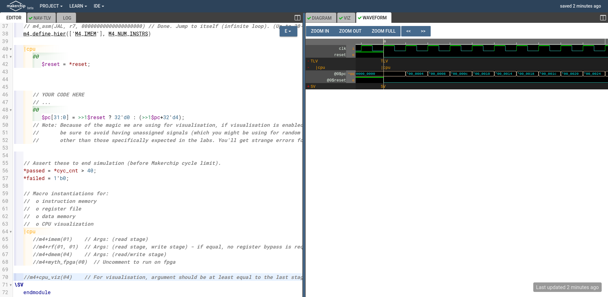

### Instruction Fetch
TL-Verilog code:
```
\m4_TLV_version 1d: tl-x.org
\SV
   // This code can be found in: https://github.com/stevehoover/RISC-V_MYTH_Workshop
   
   m4_include_lib(['https://raw.githubusercontent.com/BalaDhinesh/RISC-V_MYTH_Workshop/master/tlv_lib/risc-v_shell_lib.tlv'])

\SV
   m4_makerchip_module   // (Expanded in Nav-TLV pane.)
\TLV

   // /====================\
   // | Sum 1 to 9 Program |
   // \====================/
   //
   // Program for MYTH Workshop to test RV32I
   // Add 1,2,3,...,9 (in that order).
   //
   // Regs:
   //  r10 (a0): In: 0, Out: final sum
   //  r12 (a2): 10
   //  r13 (a3): 1..10
   //  r14 (a4): Sum
   // 
   // External to function:
   m4_asm(ADD, r10, r0, r0)             // Initialize r10 (a0) to 0.
   // Function:
   m4_asm(ADD, r14, r10, r0)            // Initialize sum register a4 with 0x0
   m4_asm(ADDI, r12, r10, 1010)         // Store count of 10 in register a2.
   m4_asm(ADD, r13, r10, r0)            // Initialize intermediate sum register a3 with 0
   // Loop:
   m4_asm(ADD, r14, r13, r14)           // Incremental addition
   m4_asm(ADDI, r13, r13, 1)            // Increment intermediate register by 1
   m4_asm(BLT, r13, r12, 1111111111000) // If a3 is less than a2, branch to label named <loop>
   m4_asm(ADD, r10, r14, r0)            // Store final result to register a0 so that it can be read by main program
   
   // Optional:
   // m4_asm(JAL, r7, 00000000000000000000) // Done. Jump to itself (infinite loop). (Up to 20-bit signed immediate plus implicit 0 bit (unlike JALR) provides byte address; last immediate bit should also be 0)
   m4_define_hier(['M4_IMEM'], M4_NUM_INSTRS)

   |cpu
      @0
         $reset = *reset;


      // YOUR CODE HERE
      // ...
      @0
         $pc[31:0] = >>1$reset ? 32'd0 : (>>1$pc+32'd4);
      @1
         $imem_rd_en = !$reset;
         $imem_rd_addr[M4_IMEM_INDEX_CNT-1:0] = $pc[M4_IMEM_INDEX_CNT+1:2];
         $instr[31:0] = $imem_rd_data[31:0];
      ?$imem_rd_en
         @1
            $imem_rd_data[31:0] = /imem[$imem_rd_addr]$instr;
      // Note: Because of the magic we are using for visualisation, if visualisation is enabled below,
      //       be sure to avoid having unassigned signals (which you might be using for random inputs)
      //       other than those specifically expected in the labs. You'll get strange errors for these.

   
   // Assert these to end simulation (before Makerchip cycle limit).
   *passed = *cyc_cnt > 40;
   *failed = 1'b0;
   
   // Macro instantiations for:
   //  o instruction memory
   //  o register file
   //  o data memory
   //  o CPU visualization
   |cpu
      m4+imem(@1)    // Args: (read stage)
      //m4+rf(@1, @1)  // Args: (read stage, write stage) - if equal, no register bypass is required
      //m4+dmem(@4)    // Args: (read/write stage)
      //m4+myth_fpga(@0)  // Uncomment to run on fpga

   m4+cpu_viz(@4)    // For visualisation, argument should be at least equal to the last stage of CPU logic. @4 would work for all labs.
\SV
   endmodule
```
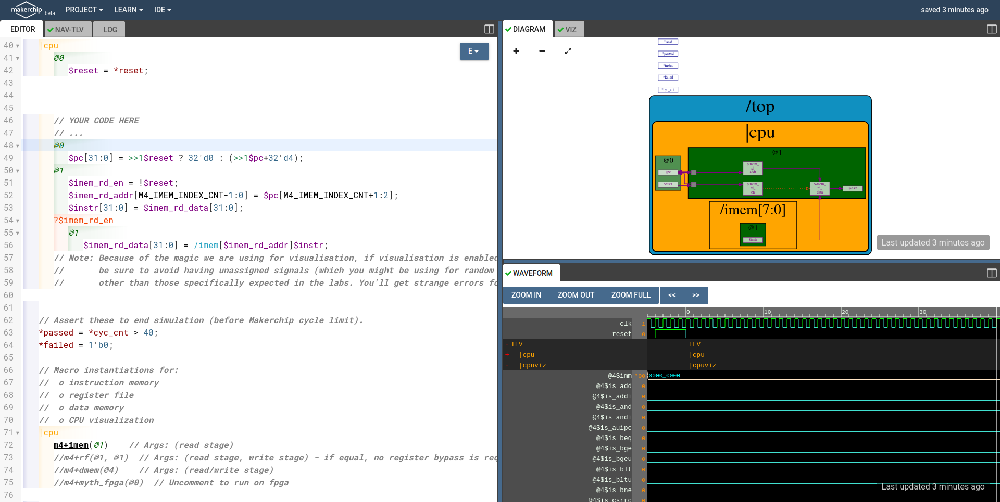

### Instruction Decode
TL-Verilog code:
```
\m4_TLV_version 1d: tl-x.org
\SV
   // This code can be found in: https://github.com/stevehoover/RISC-V_MYTH_Workshop
   
   m4_include_lib(['https://raw.githubusercontent.com/BalaDhinesh/RISC-V_MYTH_Workshop/master/tlv_lib/risc-v_shell_lib.tlv'])

\SV
   m4_makerchip_module   // (Expanded in Nav-TLV pane.)
\TLV

   // /====================\
   // | Sum 1 to 9 Program |
   // \====================/
   //
   // Program for MYTH Workshop to test RV32I
   // Add 1,2,3,...,9 (in that order).
   //
   // Regs:
   //  r10 (a0): In: 0, Out: final sum
   //  r12 (a2): 10
   //  r13 (a3): 1..10
   //  r14 (a4): Sum
   // 
   // External to function:
   m4_asm(ADD, r10, r0, r0)             // Initialize r10 (a0) to 0.
   // Function:
   m4_asm(ADD, r14, r10, r0)            // Initialize sum register a4 with 0x0
   m4_asm(ADDI, r12, r10, 1010)         // Store count of 10 in register a2.
   m4_asm(ADD, r13, r10, r0)            // Initialize intermediate sum register a3 with 0
   // Loop:
   m4_asm(ADD, r14, r13, r14)           // Incremental addition
   m4_asm(ADDI, r13, r13, 1)            // Increment intermediate register by 1
   m4_asm(BLT, r13, r12, 1111111111000) // If a3 is less than a2, branch to label named <loop>
   m4_asm(ADD, r10, r14, r0)            // Store final result to register a0 so that it can be read by main program
   
   // Optional:
   // m4_asm(JAL, r7, 00000000000000000000) // Done. Jump to itself (infinite loop). (Up to 20-bit signed immediate plus implicit 0 bit (unlike JALR) provides byte address; last immediate bit should also be 0)
   m4_define_hier(['M4_IMEM'], M4_NUM_INSTRS)

   |cpu
      @0
         $reset = *reset;


      // YOUR CODE HERE
      // ...
      @0
         $pc[31:0] = >>1$reset ? 32'd0 : (>>1$pc+32'd4);
      @1
         //Instruction Fetch
         $imem_rd_en = !$reset;
         $imem_rd_addr[M4_IMEM_INDEX_CNT-1:0] = $pc[M4_IMEM_INDEX_CNT+1:2];
         $instr[31:0] = $imem_rd_data[31:0];
      ?$imem_rd_en
         @1
            $imem_rd_data[31:0] = /imem[$imem_rd_addr]$instr;
      @1
         //Instruction Decode
         $is_i_instr = $instr[6:2] ==? 5'b0000x ||
                       $instr[6:2] ==? 5'b001x0 ||
                       $instr[6:2] ==? 5'b11001 ||
                       $instr[6:2] ==? 5'b11100;
         
         $is_u_instr = $instr[6:2] ==? 5'b0x101;
         
         $is_r_instr = $instr[6:2] ==? 5'b01011 ||
                       $instr[6:2] ==? 5'b011x0 ||
                       $instr[6:2] ==? 5'b10100;
         
         $is_b_instr = $instr[6:2] ==? 5'b11000;
         
         $is_j_instr = $instr[6:2] ==? 5'b11011;
         
         $is_s_instr = $instr[6:2] ==? 5'b0100x;
         
         $imm[31:0] = $is_i_instr ? {{21{$instr[31]}}, $instr[30:20]} :
                      $is_s_instr ? {{21{$instr[31]}}, $instr[30:25], $instr[11:7]} :
                      $is_b_instr ? {{20{$instr[31]}}, $instr[7], $instr[30:25], $instr[11:8], 1'b0} :
                      $is_u_instr ? {$instr[31:12], 12'b0} :
                      $is_j_instr ? {{12{$instr[31]}}, $instr[19:12], $instr[20], $instr[30:21], 1'b0} :
                                    32'b0;
         $opcode[6:0] = $instr[6:0];
         
         $rs2_valid = $is_r_instr || $is_s_instr || $is_b_instr;
         ?$rs2_valid
            $rs2[4:0] = $instr[24:20];
            
         $rs1_valid = $is_r_instr || $is_i_instr || $is_s_instr || $is_b_instr;
         ?$rs1_valid
            $rs1[4:0] = $instr[19:15];
         
         $funct3_valid = $is_r_instr || $is_i_instr || $is_s_instr || $is_b_instr;
         ?$funct3_valid
            $funct3[2:0] = $instr[14:12];
            
         $funct7_valid = $is_r_instr ;
         ?$funct7_valid
            $funct7[6:0] = $instr[31:25];
            
         $rd_valid = $is_r_instr || $is_i_instr || $is_u_instr || $is_j_instr;
         ?$rd_valid
            $rd[4:0] = $instr[11:7];
            
         $dec_bits [10:0] = {$funct7[5], $funct3, $opcode};
         $is_beq = $dec_bits ==? 11'bx_000_1100011;
         $is_bne = $dec_bits ==? 11'bx_001_1100011;
         $is_blt = $dec_bits ==? 11'bx_100_1100011;
         $is_bge = $dec_bits ==? 11'bx_101_1100011;
         $is_bltu = $dec_bits ==? 11'bx_110_1100011;
         $is_bgeu = $dec_bits ==? 11'bx_111_1100011;
         $is_addi = $dec_bits ==? 11'bx_000_0010011;
         $is_add = $dec_bits ==? 11'b0_000_0110011;
      
      // Note: Because of the magic we are using for visualisation, if visualisation is enabled below,
      //       be sure to avoid having unassigned signals (which you might be using for random inputs)
      //       other than those specifically expected in the labs. You'll get strange errors for these.

   
   // Assert these to end simulation (before Makerchip cycle limit).
   *passed = *cyc_cnt > 40;
   *failed = 1'b0;
   
   // Macro instantiations for:
   //  o instruction memory
   //  o register file
   //  o data memory
   //  o CPU visualization
   |cpu
      m4+imem(@1)    // Args: (read stage)
      //m4+rf(@1, @1)  // Args: (read stage, write stage) - if equal, no register bypass is required
      //m4+dmem(@4)    // Args: (read/write stage)
      //m4+myth_fpga(@0)  // Uncomment to run on fpga

   m4+cpu_viz(@4)    // For visualisation, argument should be at least equal to the last stage of CPU logic. @4 would work for all labs.
\SV
   endmodule
```
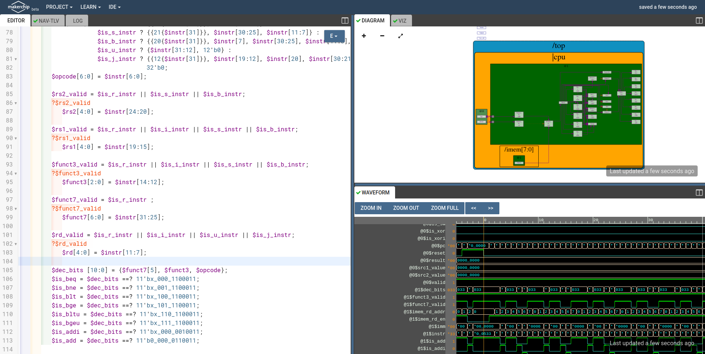

### Register File Read
TL-Verilog code:
```
\m4_TLV_version 1d: tl-x.org
\SV
   // This code can be found in: https://github.com/stevehoover/RISC-V_MYTH_Workshop
   
   m4_include_lib(['https://raw.githubusercontent.com/BalaDhinesh/RISC-V_MYTH_Workshop/master/tlv_lib/risc-v_shell_lib.tlv'])

\SV
   m4_makerchip_module   // (Expanded in Nav-TLV pane.)
\TLV

   // /====================\
   // | Sum 1 to 9 Program |
   // \====================/
   //
   // Program for MYTH Workshop to test RV32I
   // Add 1,2,3,...,9 (in that order).
   //
   // Regs:
   //  r10 (a0): In: 0, Out: final sum
   //  r12 (a2): 10
   //  r13 (a3): 1..10
   //  r14 (a4): Sum
   // 
   // External to function:
   m4_asm(ADD, r10, r0, r0)             // Initialize r10 (a0) to 0.
   // Function:
   m4_asm(ADD, r14, r10, r0)            // Initialize sum register a4 with 0x0
   m4_asm(ADDI, r12, r10, 1010)         // Store count of 10 in register a2.
   m4_asm(ADD, r13, r10, r0)            // Initialize intermediate sum register a3 with 0
   // Loop:
   m4_asm(ADD, r14, r13, r14)           // Incremental addition
   m4_asm(ADDI, r13, r13, 1)            // Increment intermediate register by 1
   m4_asm(BLT, r13, r12, 1111111111000) // If a3 is less than a2, branch to label named <loop>
   m4_asm(ADD, r10, r14, r0)            // Store final result to register a0 so that it can be read by main program
   
   // Optional:
   // m4_asm(JAL, r7, 00000000000000000000) // Done. Jump to itself (infinite loop). (Up to 20-bit signed immediate plus implicit 0 bit (unlike JALR) provides byte address; last immediate bit should also be 0)
   m4_define_hier(['M4_IMEM'], M4_NUM_INSTRS)

   |cpu
      @0
         $reset = *reset;


      // YOUR CODE HERE
      // ...
      @0
         $pc[31:0] = >>1$reset ? 32'd0 : (>>1$pc+32'd4);
      @1
         //Instruction Fetch
         $imem_rd_en = !$reset;
         $imem_rd_addr[M4_IMEM_INDEX_CNT-1:0] = $pc[M4_IMEM_INDEX_CNT+1:2];
         $instr[31:0] = $imem_rd_data[31:0];
      ?$imem_rd_en
         @1
            $imem_rd_data[31:0] = /imem[$imem_rd_addr]$instr;
      @1
         //Instruction Decode
         $is_i_instr = $instr[6:2] ==? 5'b0000x ||
                       $instr[6:2] ==? 5'b001x0 ||
                       $instr[6:2] ==? 5'b11001 ||
                       $instr[6:2] ==? 5'b11100;
         
         $is_u_instr = $instr[6:2] ==? 5'b0x101;
         
         $is_r_instr = $instr[6:2] ==? 5'b01011 ||
                       $instr[6:2] ==? 5'b011x0 ||
                       $instr[6:2] ==? 5'b10100;
         
         $is_b_instr = $instr[6:2] ==? 5'b11000;
         
         $is_j_instr = $instr[6:2] ==? 5'b11011;
         
         $is_s_instr = $instr[6:2] ==? 5'b0100x;
         
         $imm[31:0] = $is_i_instr ? {{21{$instr[31]}}, $instr[30:20]} :
                      $is_s_instr ? {{21{$instr[31]}}, $instr[30:25], $instr[11:7]} :
                      $is_b_instr ? {{20{$instr[31]}}, $instr[7], $instr[30:25], $instr[11:8], 1'b0} :
                      $is_u_instr ? {$instr[31:12], 12'b0} :
                      $is_j_instr ? {{12{$instr[31]}}, $instr[19:12], $instr[20], $instr[30:21], 1'b0} :
                                    32'b0;
         $opcode[6:0] = $instr[6:0];
         
         $rs2_valid = $is_r_instr || $is_s_instr || $is_b_instr;
         ?$rs2_valid
            $rs2[4:0] = $instr[24:20];
            
         $rs1_valid = $is_r_instr || $is_i_instr || $is_s_instr || $is_b_instr;
         ?$rs1_valid
            $rs1[4:0] = $instr[19:15];
         
         $funct3_valid = $is_r_instr || $is_i_instr || $is_s_instr || $is_b_instr;
         ?$funct3_valid
            $funct3[2:0] = $instr[14:12];
            
         $funct7_valid = $is_r_instr ;
         ?$funct7_valid
            $funct7[6:0] = $instr[31:25];
            
         $rd_valid = $is_r_instr || $is_i_instr || $is_u_instr || $is_j_instr;
         ?$rd_valid
            $rd[4:0] = $instr[11:7];
            
         $dec_bits [10:0] = {$funct7[5], $funct3, $opcode};
         $is_beq = $dec_bits ==? 11'bx_000_1100011;
         $is_bne = $dec_bits ==? 11'bx_001_1100011;
         $is_blt = $dec_bits ==? 11'bx_100_1100011;
         $is_bge = $dec_bits ==? 11'bx_101_1100011;
         $is_bltu = $dec_bits ==? 11'bx_110_1100011;
         $is_bgeu = $dec_bits ==? 11'bx_111_1100011;
         $is_addi = $dec_bits ==? 11'bx_000_0010011;
         $is_add = $dec_bits ==? 11'b0_000_0110011;
         
      @1
         //Register File Read
         $rf_wr_en = 1'b0;
         $rf_wr_index[4:0] = 5'b0;
         $rf_wr_data[31:0] = 32'b0;
         
         $rf_rd_en1 = $rs1_valid;
         $rf_rd_index1[4:0] = $rs1;
         
         $rf_rd_en2 = $rs2_valid;
         $rf_rd_index2[4:0] = $rs2;
         
         $src1_value[31:0] = $rf_rd_data1;
         $src2_value[31:0] = $rf_rd_data2;
         
      // Note: Because of the magic we are using for visualisation, if visualisation is enabled below,
      //       be sure to avoid having unassigned signals (which you might be using for random inputs)
      //       other than those specifically expected in the labs. You'll get strange errors for these.

   
   // Assert these to end simulation (before Makerchip cycle limit).
   *passed = *cyc_cnt > 40;
   *failed = 1'b0;
   
   // Macro instantiations for:
   //  o instruction memory
   //  o register file
   //  o data memory
   //  o CPU visualization
   |cpu
      m4+imem(@1)    // Args: (read stage)
      m4+rf(@1, @1)  // Args: (read stage, write stage) - if equal, no register bypass is required
      //m4+dmem(@4)    // Args: (read/write stage)
      //m4+myth_fpga(@0)  // Uncomment to run on fpga

   m4+cpu_viz(@4)    // For visualisation, argument should be at least equal to the last stage of CPU logic. @4 would work for all labs.
\SV
   endmodule
```
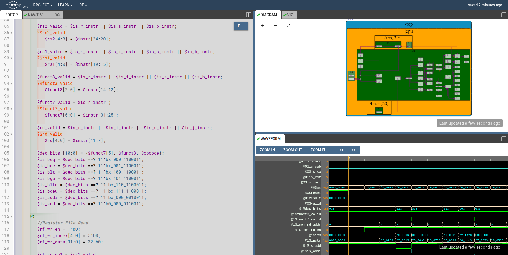

### ALU
TL-Verilog code:
```
\m4_TLV_version 1d: tl-x.org
\SV
   // This code can be found in: https://github.com/stevehoover/RISC-V_MYTH_Workshop
   
   m4_include_lib(['https://raw.githubusercontent.com/BalaDhinesh/RISC-V_MYTH_Workshop/master/tlv_lib/risc-v_shell_lib.tlv'])

\SV
   m4_makerchip_module   // (Expanded in Nav-TLV pane.)
\TLV

   // /====================\
   // | Sum 1 to 9 Program |
   // \====================/
   //
   // Program for MYTH Workshop to test RV32I
   // Add 1,2,3,...,9 (in that order).
   //
   // Regs:
   //  r10 (a0): In: 0, Out: final sum
   //  r12 (a2): 10
   //  r13 (a3): 1..10
   //  r14 (a4): Sum
   // 
   // External to function:
   m4_asm(ADD, r10, r0, r0)             // Initialize r10 (a0) to 0.
   // Function:
   m4_asm(ADD, r14, r10, r0)            // Initialize sum register a4 with 0x0
   m4_asm(ADDI, r12, r10, 1010)         // Store count of 10 in register a2.
   m4_asm(ADD, r13, r10, r0)            // Initialize intermediate sum register a3 with 0
   // Loop:
   m4_asm(ADD, r14, r13, r14)           // Incremental addition
   m4_asm(ADDI, r13, r13, 1)            // Increment intermediate register by 1
   m4_asm(BLT, r13, r12, 1111111111000) // If a3 is less than a2, branch to label named <loop>
   m4_asm(ADD, r10, r14, r0)            // Store final result to register a0 so that it can be read by main program
   
   // Optional:
   // m4_asm(JAL, r7, 00000000000000000000) // Done. Jump to itself (infinite loop). (Up to 20-bit signed immediate plus implicit 0 bit (unlike JALR) provides byte address; last immediate bit should also be 0)
   m4_define_hier(['M4_IMEM'], M4_NUM_INSTRS)

   |cpu
      @0
         $reset = *reset;


      // YOUR CODE HERE
      // ...
      @0
         $pc[31:0] = >>1$reset ? 32'd0 : (>>1$pc+32'd4);
      @1
         //Instruction Fetch
         $imem_rd_en = !$reset;
         $imem_rd_addr[M4_IMEM_INDEX_CNT-1:0] = $pc[M4_IMEM_INDEX_CNT+1:2];
         $instr[31:0] = $imem_rd_data[31:0];
      ?$imem_rd_en
         @1
            $imem_rd_data[31:0] = /imem[$imem_rd_addr]$instr;
      @1
         //Instruction Decode
         $is_i_instr = $instr[6:2] ==? 5'b0000x ||
                       $instr[6:2] ==? 5'b001x0 ||
                       $instr[6:2] ==? 5'b11001 ||
                       $instr[6:2] ==? 5'b11100;
         
         $is_u_instr = $instr[6:2] ==? 5'b0x101;
         
         $is_r_instr = $instr[6:2] ==? 5'b01011 ||
                       $instr[6:2] ==? 5'b011x0 ||
                       $instr[6:2] ==? 5'b10100;
         
         $is_b_instr = $instr[6:2] ==? 5'b11000;
         
         $is_j_instr = $instr[6:2] ==? 5'b11011;
         
         $is_s_instr = $instr[6:2] ==? 5'b0100x;
         
         $imm[31:0] = $is_i_instr ? {{21{$instr[31]}}, $instr[30:20]} :
                      $is_s_instr ? {{21{$instr[31]}}, $instr[30:25], $instr[11:7]} :
                      $is_b_instr ? {{20{$instr[31]}}, $instr[7], $instr[30:25], $instr[11:8], 1'b0} :
                      $is_u_instr ? {$instr[31:12], 12'b0} :
                      $is_j_instr ? {{12{$instr[31]}}, $instr[19:12], $instr[20], $instr[30:21], 1'b0} :
                                    32'b0;
         $opcode[6:0] = $instr[6:0];
         
         $rs2_valid = $is_r_instr || $is_s_instr || $is_b_instr;
         ?$rs2_valid
            $rs2[4:0] = $instr[24:20];
            
         $rs1_valid = $is_r_instr || $is_i_instr || $is_s_instr || $is_b_instr;
         ?$rs1_valid
            $rs1[4:0] = $instr[19:15];
         
         $funct3_valid = $is_r_instr || $is_i_instr || $is_s_instr || $is_b_instr;
         ?$funct3_valid
            $funct3[2:0] = $instr[14:12];
            
         $funct7_valid = $is_r_instr ;
         ?$funct7_valid
            $funct7[6:0] = $instr[31:25];
            
         $rd_valid = $is_r_instr || $is_i_instr || $is_u_instr || $is_j_instr;
         ?$rd_valid
            $rd[4:0] = $instr[11:7];
            
         $dec_bits [10:0] = {$funct7[5], $funct3, $opcode};
         $is_beq = $dec_bits ==? 11'bx_000_1100011;
         $is_bne = $dec_bits ==? 11'bx_001_1100011;
         $is_blt = $dec_bits ==? 11'bx_100_1100011;
         $is_bge = $dec_bits ==? 11'bx_101_1100011;
         $is_bltu = $dec_bits ==? 11'bx_110_1100011;
         $is_bgeu = $dec_bits ==? 11'bx_111_1100011;
         $is_addi = $dec_bits ==? 11'bx_000_0010011;
         $is_add = $dec_bits ==? 11'b0_000_0110011;
         
      @1
         //Register File Read
         $rf_wr_en = 1'b0;
         $rf_wr_index[4:0] = 5'b0;
         $rf_wr_data[31:0] = 32'b0;
         
         $rf_rd_en1 = $rs1_valid;
         $rf_rd_index1[4:0] = $rs1;
         
         $rf_rd_en2 = $rs2_valid;
         $rf_rd_index2[4:0] = $rs2;
         
         $src1_value[31:0] = $rf_rd_data1;
         $src2_value[31:0] = $rf_rd_data2;
         
      @1
         //ALU
         $result[31:0] = $is_addi ? $src1_value + $imm :
                         $is_add ? $src1_value + $src2_value :
                         32'bx ;
         
      // Note: Because of the magic we are using for visualisation, if visualisation is enabled below,
      //       be sure to avoid having unassigned signals (which you might be using for random inputs)
      //       other than those specifically expected in the labs. You'll get strange errors for these.

   
   // Assert these to end simulation (before Makerchip cycle limit).
   *passed = *cyc_cnt > 40;
   *failed = 1'b0;
   
   // Macro instantiations for:
   //  o instruction memory
   //  o register file
   //  o data memory
   //  o CPU visualization
   |cpu
      m4+imem(@1)    // Args: (read stage)
      m4+rf(@1, @1)  // Args: (read stage, write stage) - if equal, no register bypass is required
      //m4+dmem(@4)    // Args: (read/write stage)
      //m4+myth_fpga(@0)  // Uncomment to run on fpga

   m4+cpu_viz(@4)    // For visualisation, argument should be at least equal to the last stage of CPU logic. @4 would work for all labs.
\SV
   endmodule
```
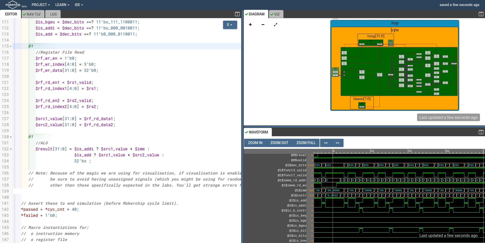

### Register File Write
TL-Verilog code:
```
\m4_TLV_version 1d: tl-x.org
\SV
   // This code can be found in: https://github.com/stevehoover/RISC-V_MYTH_Workshop
   
   m4_include_lib(['https://raw.githubusercontent.com/BalaDhinesh/RISC-V_MYTH_Workshop/master/tlv_lib/risc-v_shell_lib.tlv'])

\SV
   m4_makerchip_module   // (Expanded in Nav-TLV pane.)
\TLV

   // /====================\
   // | Sum 1 to 9 Program |
   // \====================/
   //
   // Program for MYTH Workshop to test RV32I
   // Add 1,2,3,...,9 (in that order).
   //
   // Regs:
   //  r10 (a0): In: 0, Out: final sum
   //  r12 (a2): 10
   //  r13 (a3): 1..10
   //  r14 (a4): Sum
   // 
   // External to function:
   m4_asm(ADD, r10, r0, r0)             // Initialize r10 (a0) to 0.
   // Function:
   m4_asm(ADD, r14, r10, r0)            // Initialize sum register a4 with 0x0
   m4_asm(ADDI, r12, r10, 1010)         // Store count of 10 in register a2.
   m4_asm(ADD, r13, r10, r0)            // Initialize intermediate sum register a3 with 0
   // Loop:
   m4_asm(ADD, r14, r13, r14)           // Incremental addition
   m4_asm(ADDI, r13, r13, 1)            // Increment intermediate register by 1
   m4_asm(BLT, r13, r12, 1111111111000) // If a3 is less than a2, branch to label named <loop>
   m4_asm(ADD, r10, r14, r0)            // Store final result to register a0 so that it can be read by main program
   
   // Optional:
   // m4_asm(JAL, r7, 00000000000000000000) // Done. Jump to itself (infinite loop). (Up to 20-bit signed immediate plus implicit 0 bit (unlike JALR) provides byte address; last immediate bit should also be 0)
   m4_define_hier(['M4_IMEM'], M4_NUM_INSTRS)

   |cpu
      @0
         $reset = *reset;


      // YOUR CODE HERE
      // ...
      @0
         $pc[31:0] = >>1$reset ? 32'd0 : (>>1$pc+32'd4);
      @1
         //Instruction Fetch
         $imem_rd_en = !$reset;
         $imem_rd_addr[M4_IMEM_INDEX_CNT-1:0] = $pc[M4_IMEM_INDEX_CNT+1:2];
         $instr[31:0] = $imem_rd_data[31:0];
      ?$imem_rd_en
         @1
            $imem_rd_data[31:0] = /imem[$imem_rd_addr]$instr;
      @1
         //Instruction Decode
         $is_i_instr = $instr[6:2] ==? 5'b0000x ||
                       $instr[6:2] ==? 5'b001x0 ||
                       $instr[6:2] ==? 5'b11001 ||
                       $instr[6:2] ==? 5'b11100;
         
         $is_u_instr = $instr[6:2] ==? 5'b0x101;
         
         $is_r_instr = $instr[6:2] ==? 5'b01011 ||
                       $instr[6:2] ==? 5'b011x0 ||
                       $instr[6:2] ==? 5'b10100;
         
         $is_b_instr = $instr[6:2] ==? 5'b11000;
         
         $is_j_instr = $instr[6:2] ==? 5'b11011;
         
         $is_s_instr = $instr[6:2] ==? 5'b0100x;
         
         $imm[31:0] = $is_i_instr ? {{21{$instr[31]}}, $instr[30:20]} :
                      $is_s_instr ? {{21{$instr[31]}}, $instr[30:25], $instr[11:7]} :
                      $is_b_instr ? {{20{$instr[31]}}, $instr[7], $instr[30:25], $instr[11:8], 1'b0} :
                      $is_u_instr ? {$instr[31:12], 12'b0} :
                      $is_j_instr ? {{12{$instr[31]}}, $instr[19:12], $instr[20], $instr[30:21], 1'b0} :
                                    32'b0;
         $opcode[6:0] = $instr[6:0];
         
         $rs2_valid = $is_r_instr || $is_s_instr || $is_b_instr;
         ?$rs2_valid
            $rs2[4:0] = $instr[24:20];
            
         $rs1_valid = $is_r_instr || $is_i_instr || $is_s_instr || $is_b_instr;
         ?$rs1_valid
            $rs1[4:0] = $instr[19:15];
         
         $funct3_valid = $is_r_instr || $is_i_instr || $is_s_instr || $is_b_instr;
         ?$funct3_valid
            $funct3[2:0] = $instr[14:12];
            
         $funct7_valid = $is_r_instr ;
         ?$funct7_valid
            $funct7[6:0] = $instr[31:25];
            
         $rd_valid = $is_r_instr || $is_i_instr || $is_u_instr || $is_j_instr;
         ?$rd_valid 
            $rd[4:0] = $instr[11:7]; //rd - Destination Register
            
         $dec_bits [10:0] = {$funct7[5], $funct3, $opcode};
         $is_beq = $dec_bits ==? 11'bx_000_1100011;
         $is_bne = $dec_bits ==? 11'bx_001_1100011;
         $is_blt = $dec_bits ==? 11'bx_100_1100011;
         $is_bge = $dec_bits ==? 11'bx_101_1100011;
         $is_bltu = $dec_bits ==? 11'bx_110_1100011;
         $is_bgeu = $dec_bits ==? 11'bx_111_1100011;
         $is_addi = $dec_bits ==? 11'bx_000_0010011;
         $is_add = $dec_bits ==? 11'b0_000_0110011;
         
      @1
         //Register File Read
         $rf_wr_en = 1'b0;
         $rf_wr_index[4:0] = 5'b0;
         $rf_wr_data[31:0] = 32'b0;
         
         $rf_rd_en1 = $rs1_valid;
         $rf_rd_index1[4:0] = $rs1;
         
         $rf_rd_en2 = $rs2_valid;
         $rf_rd_index2[4:0] = $rs2;
         
         $src1_value[31:0] = $rf_rd_data1;
         $src2_value[31:0] = $rf_rd_data2;
         
      @1
         //ALU
         $result[31:0] = $is_addi ? $src1_value + $imm :
                         $is_add ? $src1_value + $src2_value :
                         32'bx ;
      @1
         //Register File Write
         $rf_wr_en = $rd_valid && $rd != 5'b0;
         $rf_wr_index[4:0] = $rd;
         $rf_wr_data[31:0] = $result;
         
      // Note: Because of the magic we are using for visualisation, if visualisation is enabled below,
      //       be sure to avoid having unassigned signals (which you might be using for random inputs)
      //       other than those specifically expected in the labs. You'll get strange errors for these.

   
   // Assert these to end simulation (before Makerchip cycle limit).
   *passed = *cyc_cnt > 40;
   *failed = 1'b0;
   
   // Macro instantiations for:
   //  o instruction memory
   //  o register file
   //  o data memory
   //  o CPU visualization
   |cpu
      m4+imem(@1)    // Args: (read stage)
      m4+rf(@1, @1)  // Args: (read stage, write stage) - if equal, no register bypass is required
      //m4+dmem(@4)    // Args: (read/write stage)
      //m4+myth_fpga(@0)  // Uncomment to run on fpga

   m4+cpu_viz(@4)    // For visualisation, argument should be at least equal to the last stage of CPU logic. @4 would work for all labs.
\SV
   endmodule
```
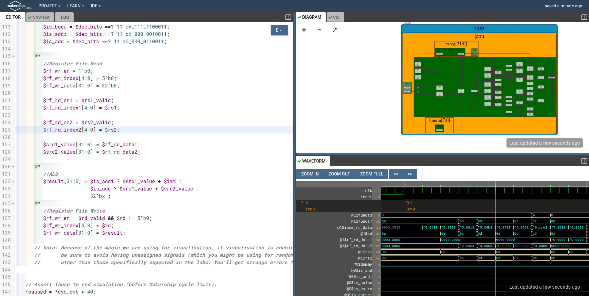

### Branch Instructions
TL-Verilog code:
```
\m4_TLV_version 1d: tl-x.org
\SV
   // This code can be found in: https://github.com/stevehoover/RISC-V_MYTH_Workshop
   
   m4_include_lib(['https://raw.githubusercontent.com/BalaDhinesh/RISC-V_MYTH_Workshop/master/tlv_lib/risc-v_shell_lib.tlv'])

\SV
   m4_makerchip_module   // (Expanded in Nav-TLV pane.)
\TLV

   // /====================\
   // | Sum 1 to 9 Program |
   // \====================/
   //
   // Program for MYTH Workshop to test RV32I
   // Add 1,2,3,...,9 (in that order).
   //
   // Regs:
   //  r10 (a0): In: 0, Out: final sum
   //  r12 (a2): 10
   //  r13 (a3): 1..10
   //  r14 (a4): Sum
   // 
   // External to function:
   m4_asm(ADD, r10, r0, r0)             // Initialize r10 (a0) to 0.
   // Function:
   m4_asm(ADD, r14, r10, r0)            // Initialize sum register a4 with 0x0
   m4_asm(ADDI, r12, r10, 1010)         // Store count of 10 in register a2.
   m4_asm(ADD, r13, r10, r0)            // Initialize intermediate sum register a3 with 0
   // Loop:
   m4_asm(ADD, r14, r13, r14)           // Incremental addition
   m4_asm(ADDI, r13, r13, 1)            // Increment intermediate register by 1
   m4_asm(BLT, r13, r12, 1111111111000) // If a3 is less than a2, branch to label named <loop>
   m4_asm(ADD, r10, r14, r0)            // Store final result to register a0 so that it can be read by main program
   
   // Optional:
   // m4_asm(JAL, r7, 00000000000000000000) // Done. Jump to itself (infinite loop). (Up to 20-bit signed immediate plus implicit 0 bit (unlike JALR) provides byte address; last immediate bit should also be 0)
   m4_define_hier(['M4_IMEM'], M4_NUM_INSTRS)

   |cpu
      @0
         $reset = *reset;


      // YOUR CODE HERE
      // ...
      @0
         $pc[31:0] = >>1$reset ? 32'd0 : (>>1$taken_branch ? >>1$br_tgt_pc :  (>>1$pc+32'd4));
      @1
         //Instruction Fetch
         $imem_rd_en = !$reset;
         $imem_rd_addr[M4_IMEM_INDEX_CNT-1:0] = $pc[M4_IMEM_INDEX_CNT+1:2];
         $instr[31:0] = $imem_rd_data[31:0];
      ?$imem_rd_en
         @1
            $imem_rd_data[31:0] = /imem[$imem_rd_addr]$instr;
      @1
         //Instruction Decode
         $is_i_instr = $instr[6:2] ==? 5'b0000x ||
                       $instr[6:2] ==? 5'b001x0 ||
                       $instr[6:2] ==? 5'b11001 ||
                       $instr[6:2] ==? 5'b11100;
         
         $is_u_instr = $instr[6:2] ==? 5'b0x101;
         
         $is_r_instr = $instr[6:2] ==? 5'b01011 ||
                       $instr[6:2] ==? 5'b011x0 ||
                       $instr[6:2] ==? 5'b10100;
         
         $is_b_instr = $instr[6:2] ==? 5'b11000;
         
         $is_j_instr = $instr[6:2] ==? 5'b11011;
         
         $is_s_instr = $instr[6:2] ==? 5'b0100x;
         
         $imm[31:0] = $is_i_instr ? {{21{$instr[31]}}, $instr[30:20]} :
                      $is_s_instr ? {{21{$instr[31]}}, $instr[30:25], $instr[11:7]} :
                      $is_b_instr ? {{20{$instr[31]}}, $instr[7], $instr[30:25], $instr[11:8], 1'b0} :
                      $is_u_instr ? {$instr[31:12], 12'b0} :
                      $is_j_instr ? {{12{$instr[31]}}, $instr[19:12], $instr[20], $instr[30:21], 1'b0} :
                                    32'b0;
         $opcode[6:0] = $instr[6:0];
         
         $rs2_valid = $is_r_instr || $is_s_instr || $is_b_instr;
         ?$rs2_valid
            $rs2[4:0] = $instr[24:20];
            
         $rs1_valid = $is_r_instr || $is_i_instr || $is_s_instr || $is_b_instr;
         ?$rs1_valid
            $rs1[4:0] = $instr[19:15];
         
         $funct3_valid = $is_r_instr || $is_i_instr || $is_s_instr || $is_b_instr;
         ?$funct3_valid
            $funct3[2:0] = $instr[14:12];
            
         $funct7_valid = $is_r_instr ;
         ?$funct7_valid
            $funct7[6:0] = $instr[31:25];
            
         $rd_valid = $is_r_instr || $is_i_instr || $is_u_instr || $is_j_instr;
         ?$rd_valid 
            $rd[4:0] = $instr[11:7]; //rd - Destination Register
            
         $dec_bits [10:0] = {$funct7[5], $funct3, $opcode};
         $is_beq = $dec_bits ==? 11'bx_000_1100011;
         $is_bne = $dec_bits ==? 11'bx_001_1100011;
         $is_blt = $dec_bits ==? 11'bx_100_1100011;
         $is_bge = $dec_bits ==? 11'bx_101_1100011;
         $is_bltu = $dec_bits ==? 11'bx_110_1100011;
         $is_bgeu = $dec_bits ==? 11'bx_111_1100011;
         $is_addi = $dec_bits ==? 11'bx_000_0010011;
         $is_add = $dec_bits ==? 11'b0_000_0110011;
         
      @1
         //Register File Read
         $rf_wr_en = 1'b0;
         $rf_wr_index[4:0] = 5'b0;
         $rf_wr_data[31:0] = 32'b0;
         
         $rf_rd_en1 = $rs1_valid;
         $rf_rd_index1[4:0] = $rs1;
         
         $rf_rd_en2 = $rs2_valid;
         $rf_rd_index2[4:0] = $rs2;
         
         $src1_value[31:0] = $rf_rd_data1;
         $src2_value[31:0] = $rf_rd_data2;
         
      @1
         //ALU
         $result[31:0] = $is_addi ? $src1_value + $imm :
                         $is_add ? $src1_value + $src2_value :
                         32'bx ;
      @1
         //Register File Write
         $rf_wr_en = $rd_valid && $rd != 5'b0;
         $rf_wr_index[4:0] = $rd;
         $rf_wr_data[31:0] = $result;
         
      @1
         //Branch Instructions
         $taken_branch = $is_beq ? ($src1_value == $src2_value):
                         $is_bne ? ($src1_value != $src2_value):
                         $is_blt ? (($src1_value < $src2_value) ^ ($src1_value[31] != $src2_value[31])):
                         $is_bge ? (($src1_value >= $src2_value) ^ ($src1_value[31] != $src2_value[31])):
                         $is_bltu ? ($src1_value < $src2_value):
                         $is_bgeu ? ($src1_value >= $src2_value):
                                    1'b0;
         `BOGUS_USE($taken_branch)
         $br_tgt_pc[31:0] = $pc + $imm;
      // Note: Because of the magic we are using for visualisation, if visualisation is enabled below,
      //       be sure to avoid having unassigned signals (which you might be using for random inputs)
      //       other than those specifically expected in the labs. You'll get strange errors for these.

   
   // Assert these to end simulation (before Makerchip cycle limit).
   *passed = *cyc_cnt > 40;
   *failed = 1'b0;
   
   // Macro instantiations for:
   //  o instruction memory
   //  o register file
   //  o data memory
   //  o CPU visualization
   |cpu
      m4+imem(@1)    // Args: (read stage)
      m4+rf(@1, @1)  // Args: (read stage, write stage) - if equal, no register bypass is required
      //m4+dmem(@4)    // Args: (read/write stage)
      //m4+myth_fpga(@0)  // Uncomment to run on fpga

   m4+cpu_viz(@4)    // For visualisation, argument should be at least equal to the last stage of CPU logic. @4 would work for all labs.
\SV
   endmodule
```
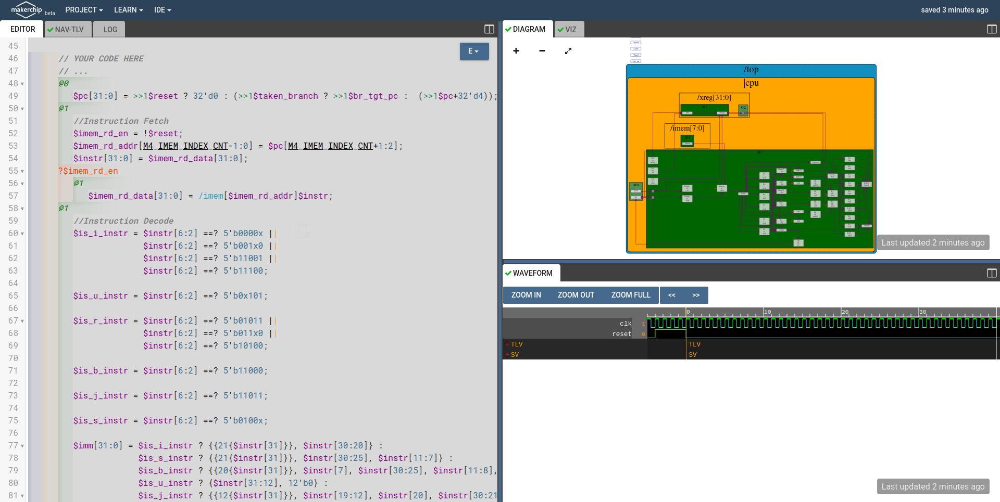

To verify with the testbench, add this to the `@1` stage:
```
*passed = |cpu/xreg[10]>>5$value == (1+2+3+4+5+6+7+8+9) ;
```
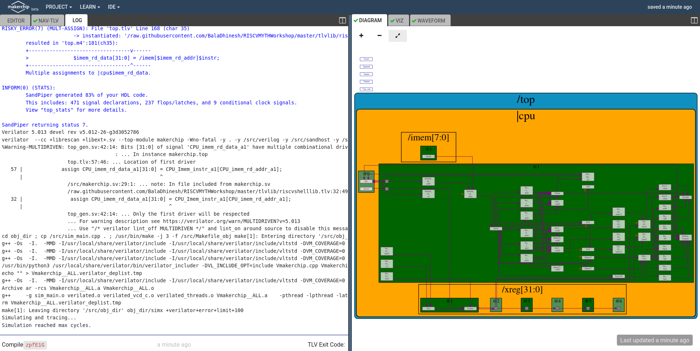


## Day - 5 : Complete Pipelined RISC-V CPU Micro-architecture

### Hazards in Pipelinig
Pipelining, for all its speed gains, introduces hazards — situations that can stall or disrupt smooth instruction flow. One of the most impactful is the branch instruction hazard, also called the "branch penalty."

Branch instructions redirect the flow of execution, letting a program make decisions, like jumping to a different section of code based on a condition. They're tricky for pipelining precisely because the branch outcome (taken or not) is typically resolved later in the pipeline than fetch and decode.

Branch hazards come in three main flavors:

1. **Structural Hazard** — a resource conflict in the pipeline, such as a branch instruction competing with another in-flight instruction for the same execution unit or memory stage, forcing a stall while the conflict clears.

2. **Data Hazard** — arises when an instruction depends on a result from a preceding instruction that isn't ready yet, which can produce wrong results if not handled. For branches specifically, this shows up when instructions after the branch depend on its (not-yet-known) outcome.

3. **Control Hazard (Branch Hazard)** — the central issue with branches. Instructions get fetched ahead of time, but a branch's actual outcome may not be known until execution. If that outcome differs from what was assumed, the instructions fetched in between are wrong and must be discarded — "flushed" — with execution restarted from the correct point. That flush is the source of the branch penalty.

**Valid signal for Pipelined Logic**

TL-Verilog for introducing a valid signal into pipelined logic:
```
	      $start = >>1$reset && !$reset;
         $valid = $reset ? 1'b0 : ($start || >>3$valid);
         $valid_or_reset = $valid || $reset;
         $rs1_or_funct3_valid    = $is_r_instr || $is_i_instr || $is_s_instr || $is_b_instr;
         $rs2_valid              = $is_r_instr || $is_s_instr || $is_b_instr;
         $rd_valid               = $is_r_instr || $is_i_instr || $is_u_instr || $is_j_instr;
         $funct7_valid           = $is_r_instr;
         
```


**Handling Data Hazards in Register File with Bypassing**

```
//Register file bypass logic - data forwarding from ALU to resolve RAW dependence
         $src1_value[31:0] = $rs1_bypass ? >>1$result[31:0] : $rf_rd_data1[31:0];
         $src2_value[31:0] = $rs2_bypass ? >>1$result[31:0] : $rf_rd_data2[31:0];
```
**Correcting branch target path**

```
 //Current instruction is valid if one of the previous 2 instructions were not (taken_branch or load or jump)
         $valid = ~(>>1$valid_taken_br || >>2$valid_taken_br || >>1$is_load || >>2$is_load || >>2$jump_valid 	|| >>1$jump_valid);
         
         //Current instruction is valid & is a taken branch
         $valid_taken_br = $valid && $taken_br;
         
         //Current instruction is valid & is a load
         $valid_load = $valid && $is_load;
         
         //Current instruction is valid & is jump
         $jump_valid = $valid && $is_jump;
         $jal_valid  = $valid && $is_jal;
         $jalr_valid = $valid && $is_jalr;
    
    *passed = |cpu/xreg[17]>>5$value == (1+2+3+4+5+6+7+8+9);

```

 
#### Final 4 Stage Pipelined Logic 
```
\m4_TLV_version 1d: tl-x.org
\SV
   // This code can be found in: https://github.com/stevehoover/RISC-V_MYTH_Workshop
   
   m4_include_lib(['https://raw.githubusercontent.com/BalaDhinesh/RISC-V_MYTH_Workshop/master/tlv_lib/risc-v_shell_lib.tlv'])

\SV
   m4_makerchip_module   // (Expanded in Nav-TLV pane.)
\TLV
     
   // /====================\
   // | Sum 1 to 9 Program |
   // \====================/
   //
   // Program for MYTH Workshop to test RV32I
   // Add 1,2,3,...,9 (in that order).
   //
   // Regs:
   //  r10 (a0): In: 0, Out: final sum
   //  r12 (a2): 10
   //  r13 (a3): 1..10
   //  r14 (a4): Sum
   // 
   // External to function:
   m4_asm(ADD, r10, r0, r0)             // Initialize r10 (a0) to 0.
   // Function:
   m4_asm(ADD, r14, r10, r0)            // Initialize sum register a4 with 0x0
   m4_asm(ADDI, r12, r10, 1010)         // Store count of 10 in register a2.
   m4_asm(ADD, r13, r10, r0)            // Initialize intermediate sum register a3 with 0
   // Loop:
   m4_asm(ADD, r14, r13, r14)           // Incremental addition
   m4_asm(ADDI, r13, r13, 1)            // Increment intermediate register by 1
   m4_asm(BLT, r13, r12, 1111111111000) // If a3 is less than a2, branch to label named <loop>
   m4_asm(ADD, r10, r14, r0)            // Store final result to register a0 so that it can be read by main program
   m4_asm(SW, r0, r10, 100)
   m4_asm(LW, r15, r0, 100)
   // Optional:
   // m4_asm(JAL, r7, 00000000000000000000) // Done. Jump to itself (infinite loop). (Up to 20-bit signed immediate plus implicit 0 bit (unlike JALR) provides byte address; last immediate bit should also be 0)
   m4_define_hier(['M4_IMEM'], M4_NUM_INSTRS)

   |cpu
      @0
         $reset = *reset;
              //Fetch1   
         $pc[31:0] = >>1$reset ? 32'b0 :
                     >>3$valid_taken_br ? >>3$br_tgt_pc :
                     >>3$valid_load ? >>3$inc_pc : 
                     (>>3$valid_jump && >>3$is_jal) ? >>3$br_tgt_pc :
                     (>>3$valid_jump && >>3$is_jalr) ? >>3$jalr_tgt_pc :
                     >>1$inc_pc;
                     
                    
      @1
         $inc_pc[31:0] = $pc + 32'd4 ;
         $imem_rd_en = !>>1$reset;    
         $imem_rd_addr[M4_IMEM_INDEX_CNT-1:0] = $pc[M4_IMEM_INDEX_CNT+1:2]; 
      @3
                
         $valid = !(>>1$valid_taken_br || >>2$valid_taken_br || >>1$valid_load || >>2$valid_load 
                    || >>1$valid_jump || >>2$valid_jump) ;
                    
         $valid_load = $valid && $is_load ;
         $valid_jump = $valid && $is_load;
                       
                       
                 
            //$valid_load = $valid && $is_load ;
                
            //Fetch2 
      @1
         $instr[31:0] = $imem_rd_data[31:0]; 
               
          //Instructions type decode 
         $is_i_instr = $instr[6:2] ==? 5'b0000x || 
                       $instr[6:2] ==? 5'b001x0 || 
                       $instr[6:2] ==? 5'b11001 ;
         $is_r_instr = $instr[6:2] ==? 5'b011x0 || 
                       $instr[6:2] ==? 5'b01011 || 
                       $instr[6:2] ==? 5'b10100 ; 
         $is_s_instr = $instr[6:2] ==? 5'b0100x ;
         $is_b_instr = $instr[6:2] ==? 5'b11000 ;
         $is_j_instr = $instr[6:2] ==? 5'b11011 ;
         $is_u_instr = $instr[6:2] ==? 5'b0x101 ;
         
           //Instruction immediate decode
         $imm[31:0] = $is_i_instr ? {{21{$instr[31]}},$instr[30:20] }:
                      $is_s_instr ? {{21{$instr[31]}},$instr[30:25],$instr[11:8],$instr[7]} :
                      $is_b_instr ? {{20{$instr[31]}},$instr[7],$instr[30:25],$instr[11:8],1'b0} :
                      $is_u_instr ? {$instr[31], $instr[30:20],$instr[19:12],12'b0 }:
                      $is_j_instr ? {{12{$instr[31]}},$instr[19:12],$instr[20],$instr[30:21],1'b0} :
                      32'b0 ;
         $opcode[6:0] = $instr[6:0];

           //b. func7 decode

         $func7_valid = $is_r_instr ;
         ?$func7_valid
            $func7[6:0] = $instr[31:25];
         //c. rs2 decode

         $rs2_valid = $is_r_instr || $is_s_instr || $is_b_instr ;
         ?$rs2_valid
            $rs2[4:0] = $instr[24:20];

          //d. rs1 valid

         $rs1_valid = $is_r_instr || $is_i_instr || $is_s_instr || $is_b_instr ;
         ?$rs1_valid
            $rs1[4:0] = $instr[19:15] ;

          //e. func3 valid

         $func3_valid = $is_r_instr || $is_i_instr || $is_s_instr || $is_b_instr ;
         ?$func3_valid
            $func3[2:0] = $instr[14:12] ;

         $rd_valid = $is_r_instr || $is_i_instr || $is_u_instr || $is_j_instr ;
         ?$rd_valid
            $rd[4:0] = $instr[11:7];     
      
         $dec_bits[10:0] = {$func7[5], $func3, $opcode} ;
         $is_beq = $dec_bits ==? 11'bx_000_1100011 ;
         $is_bne = $dec_bits ==? 11'bx_001_1100011 ;
         $is_blt = $dec_bits ==? 11'bx_100_1100011 ;
         $is_bge = $dec_bits ==? 11'bx_101_1100011 ;           
         $is_bltu = $dec_bits ==? 11'bx_110_1100011 ;
         $is_bgeu = $dec_bits ==? 11'bx_111_1100011 ;  
         $is_addi = $dec_bits ==? 11'bx_000_0010011 ;
         $is_add = $dec_bits ==? 11'b0_000_0110011 ;
         
         $is_load = $dec_bits ==? 11'bx_xxx_0000011;
         
         $is_sb = $dec_bits ==? 11'bx_000_0100011;
         $is_sh = $dec_bits ==? 11'bx_001_0100011;
         $is_sw = $dec_bits ==? 11'bx_010_0100011;
         $is_slti = $dec_bits ==? 11'bx_010_0010011;
         $is_sltiu = $dec_bits ==? 11'bx_011_0010011;
         $is_xori = $dec_bits ==? 11'bx_100_0010011;
         $is_ori = $dec_bits ==? 11'bx_110_0010011;
         $is_andi = $dec_bits ==? 11'bx_111_0010011;
         $is_slli = $dec_bits ==? 11'b0_001_0010011;
         $is_srli = $dec_bits ==? 11'b0_101_0010011;
         $is_srai = $dec_bits ==? 11'b1_101_0010011;
         $is_sub = $dec_bits ==? 11'b1_000_0110011;
         $is_sll = $dec_bits ==? 11'b0_001_0110011;
         $is_slt = $dec_bits ==? 11'b0_010_0110011;
         $is_sltu = $dec_bits ==? 11'b0_011_0110011;
         $is_xor = $dec_bits ==? 11'b0_100_0110011;
         $is_srl = $dec_bits ==? 11'b0_101_0110011;
         $is_sra = $dec_bits ==? 11'b1_101_0110011;
         $is_or = $dec_bits ==? 11'b0_110_0110011;
         $is_and = $dec_bits ==? 11'b0_111_0110011;
         $is_lui = $dec_bits ==? 11'bx_xxx_0110111;
         $is_auipc = $dec_bits ==? 11'bx_xxx_0010111;
         $is_jal = $dec_bits ==? 11'bx_xxx_1101111;
         $is_jalr = $dec_bits ==? 11'bx_000_1100111;
         $is_jump = $is_jal || $is_jalr ;
         
         `BOGUS_USE($is_beq $is_bne $is_blt $is_bge $is_bltu $is_bgeu $is_addi $is_add) 
      @2
         
            //Register file read
         $rf_rd_en1 = $rs1_valid && >>2$result ;
         $rf_rd_index1[4:0] = $rs1 ;
         $rf_rd_en2 = $rs2_valid && >>2$result;
         $rf_rd_index2[4:0] = $rs2 ;

      //Branch_instruction2
         $br_tgt_pc[31:0] = $pc + $imm ;

     //source to alu assigned with o/p of read register
         $src1_value[31:0] = 
              (>>1$rf_wr_index == $rf_rd_index1) && >>1$rf_wr_en ?
                 >>1$result :
                  $rf_rd_data1;
         $src2_value[31:0] = 
              (>>1$rf_wr_index == $rf_rd_index2) && >>1$rf_wr_en ?
                 >>1$result :
                   $rf_rd_data2;
                   
      //dmem:1-R/W memory             
      @4
         $dmem_wr_en = $is_s_instr && $valid ;
         $dmem_addr[3:0] = $result[5:2] ;
         $dmem_wr_data[31:0] = $src2_value ;
         $dmem_rd_en = $is_load ;
        
      @4
         //LOAD DATA
         $ld_data[31:0] = $dmem_rd_data ;
      @3
         $jalr_tgt_pc[31:0] = $src1_value + $imm ;
      
      @3
     //Assigning aadi and add value to alu
         $sltu_rslt[31:0] = $src1_value < $src2_value ;
         $sltiu_rslt[31:0]  = $src1_value < $imm ;
         
         $result[31:0] =
              $is_addi ? $src1_value + $imm :
              $is_add ? $src1_value + $src2_value :
              $is_andi ? $src1_value & $imm :
              $is_ori  ? $src1_value | $imm :
              $is_xori ? $src1_value ^ $imm :
              $is_slli ? $src1_value << $imm[5:0] :
              $is_srli ? $src1_value >> $imm[5:0] :
              $is_and ? $src1_value & $src2_value :
              $is_or ? $src1_value | $src2_value :
              $is_xor ? $src1_value ^ $src2_value :
              $is_sub ? $src1_value - $src2_value :
              $is_sll ? $src1_value << $src2_value[4:0] :
              $is_srl ? $src1_value >> $src2_value[4:0] :
              $is_sltu ? $src1_value < $src2_value :
              $is_sltiu ? $src1_value < $imm :
              $is_lui ? {$imm[31:12], 12'b0} :
              $is_auipc ? $pc + $imm : 
              $is_jal ? $pc + 32'd4 :
              $is_jalr ? $pc + 32'd4 :
              $is_srai ? {{32{$src1_value[31]}}, $src1_value} >> $imm[4:0] :
              $is_slt ? ($src1_value[31] == $src2_value[31]) ? $sltu_rslt : {31'b0, $src1_value[31]} :
              $is_slti ? ($src1_value[31] == $imm[31]) ? $sltiu_rslt : {31'b0, $src1_value[31]} :
              $is_sra ? {{32{$src1_value[31]}}, $src1_value} >> $src2_value[4:0] :
              $is_load || $is_s_instr ? $src1_value + $imm :
              32'bx ;
        //Register file write
         $rf_wr_en = $rd_valid && $rd != 5'b0 && $valid || >>2$valid_load ;
         $rf_wr_index[4:0] = >>2$valid_load ? >>2$rd : $rd ;
         $rf_wr_data[31:0] = >>2$valid_load ? >>2$ld_data : $result ;

        //Branch insturctions
         $taken_br = $is_beq ? ($src1_value == $src2_value):
                     $is_bne ? ($src1_value != $src2_value):
                     $is_blt ? (($src1_value < $src2_value) ^ ($src1_value[31] != $src2_value[31])):
                     $is_bge ? (($src1_value >= $src2_value) ^ ($src1_value[31]!= $src2_value[31])):
                     $is_bltu ? ($src1_value > $src2_value) :
                     $is_bgeu ? ($src1_value >= $src2_value) :
                     1'b0 ;
           //for invalid instruction
         $valid_taken_br = $valid && $taken_br ;
         
         // Note: Because of the magic we are using for visualisation, if visualisation is enabled below,
         //       be sure to avoid having unassigned signals (which you might be using for random inputs)
         //       other than those specifically expected in the labs. You'll get strange errors for these.
         // Assert these to end simulation (before Makerchip cycle limit).
          //*passed = *cyc_cnt > 40;
   *passed = |cpu/xreg[15]>>5$value == (1+2+3+4+5+6+7+8+9);
   *failed = 1'b0;
   
   // Macro instantiations for:
   //  o instruction memory
   //  o register file
   //  o data memory
   //  o CPU visualization
   |cpu
      m4+imem(@1)    // Args: (read stage)
      m4+rf(@2, @3)  // Args: (read stage, write stage) - if equal, no register bypass is required
      m4+dmem(@4)    // Args: (read/write stage)
   
   m4+cpu_viz(@4)    // For visualisation, argument should be at least equal to the last stage of CPU logic. @4 would work for all labs.
\SV
   endmodule

```

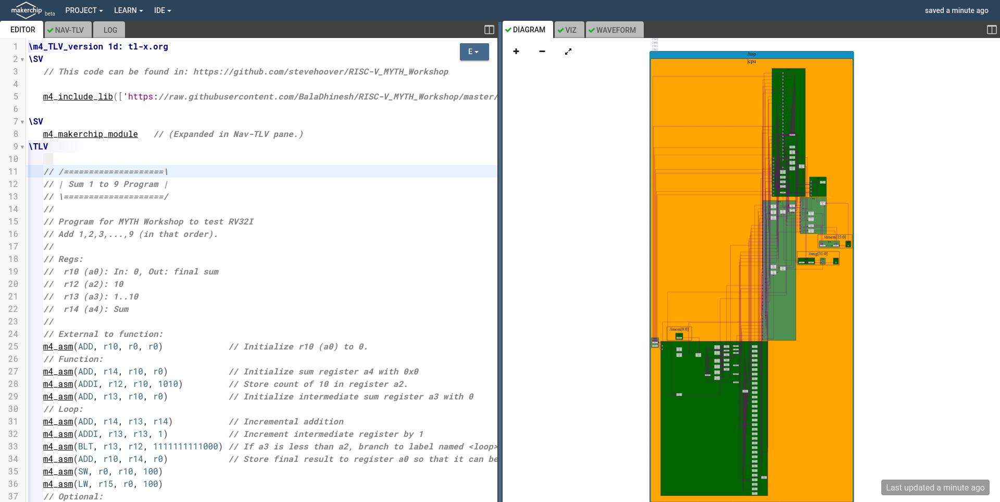 
